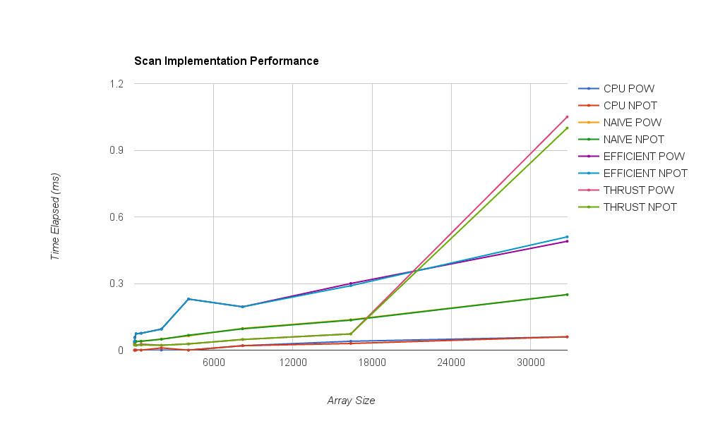
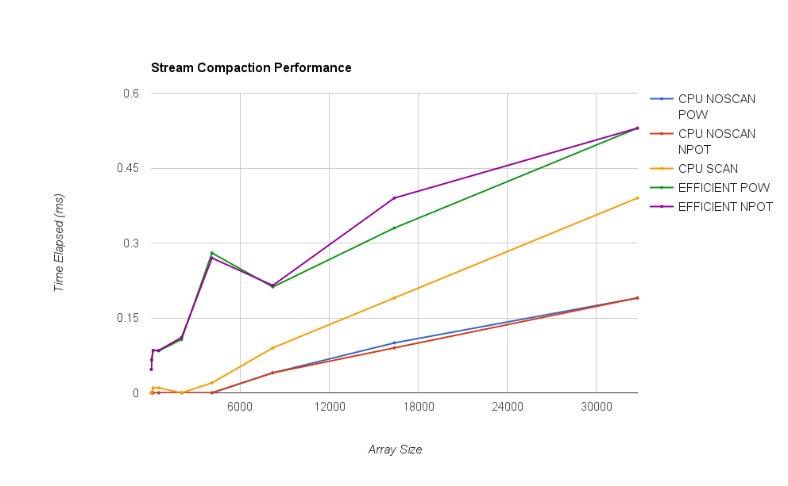

CIS 565 Project 2 - CUDA Stream Compaction
======================
* Richard Lee
* Tested on: Windows 7, i7-3720QM @ 2.60GHz 8GB, GT 650M 4GB (Personal Computer)

## Performance analysis
Performance testing was done on each implementation across a range of array sizes, averaged across 100 iterations each.


Overall, the CPU implementation for both the scan and stream compaction algorithms far outperformed their GPU counterparts. This was most likely due to the fact that they were able to deal with the input array and access memory much more efficiently than the GPU. In addition, I was only able to run the algorithms on inputs up to 2^16 in size, due to hardware restrictions - if run on even larger inputs, the GPU may have been able to take advantage of the parallel algorithms and gain a computational advantage over the CPU implementations. 

One performance bottleneck I encountered was memory, as I was unable to allocate enough memory for an array of size greater than 2^16 on the GPU. I also found that the work-efficient scan was less performant than the naive scan, which could have been due to the fact that the number of threads allocated was not adjusted at runtime based on the level of up-sweep and down-sweep, which would be an additional feature to implement. 

## Test Output
```
****************
** SCAN TESTS **
****************
    [  38  19  38  37   5  47  15  35   0  12   3   0  42 ...   7   0 ]
==== cpu scan, power-of-two ====
    [   0  38  57  95 132 137 184 199 234 234 246 249 249 ... 803684 803691 ]
==== cpu scan, non-power-of-two ====
    [   0  38  57  95 132 137 184 199 234 234 246 249 249 ... 803630 803660 ]
    passed
==== naive scan, power-of-two ====
    [   0  38  57  95 132 137 184 199 234 234 246 249 249 ... 803684 803691 ]
    passed
==== naive scan, non-power-of-two ====
    passed
==== work-efficient scan, power-of-two ====
    passed
==== work-efficient scan, non-power-of-two ====
    passed
==== thrust scan, power-of-two ====
    passed
==== thrust scan, non-power-of-two ====
    passed

****************************
** SCAN PERFORMANCE TESTS **
****************************
CPU POW SCAN TIME ELAPSED : 0.060004 milliseconds.
CPU NPOT SCAN TIME ELAPSED : 0.060004 milliseconds.
NAIVE POW SCAN TIME ELAPSED : 0.419879 milliseconds.
NAIVE NPOT SCAN TIME ELAPSED : 0.361572 milliseconds.
EFFICIENT POW SCAN TIME ELAPSED : 0.492805 milliseconds.
EFFICIENT NPOT SCAN TIME ELAPSED : 0.493135 milliseconds.
THRUST POW SCAN TIME ELAPSED : 1.0536 milliseconds.
THRUST NPOT SCAN TIME ELAPSED : 1.06989 milliseconds.

*****************************
** STREAM COMPACTION TESTS **
*****************************
    [   2   3   2   1   3   1   1   1   2   0   1   0   2 ...   3   0 ]
==== cpu compact without scan, power-of-two ====
    [   2   3   2   1   3   1   1   1   2   1   2   1   1 ...   2   3 ]
    passed
==== cpu compact without scan, non-power-of-two ====
    [   2   3   2   1   3   1   1   1   2   1   2   1   1 ...   2   2 ]
    passed
==== cpu compact with scan ====
    [   2   3   2   1   3   1   1   1   2   1   2   1   1 ...   2   3 ]
    passed
==== work-efficient compact, power-of-two ====
    passed
==== work-efficient compact, non-power-of-two ====
    passed

*****************************************
** STREAM COMPACTION PERFORMANCE TESTS **
*****************************************
CPU COMPACT NOSCAN POW TIME ELAPSED : 0.230013 milliseconds.
CPU COMPACT NOSCAN NPOT TIME ELAPSED : 0.230013 milliseconds.
CPU COMPACT SCAN TIME ELAPSED : 0.390022 milliseconds.
EFFICIENT POW COMPACT TIME ELAPSED : 0.530948 milliseconds.
EFFICIENT NPOT COMPACT TIME ELAPSED : 0.533724 milliseconds.
```