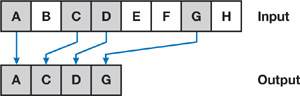
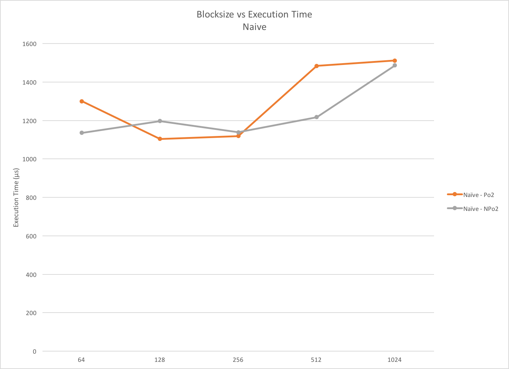
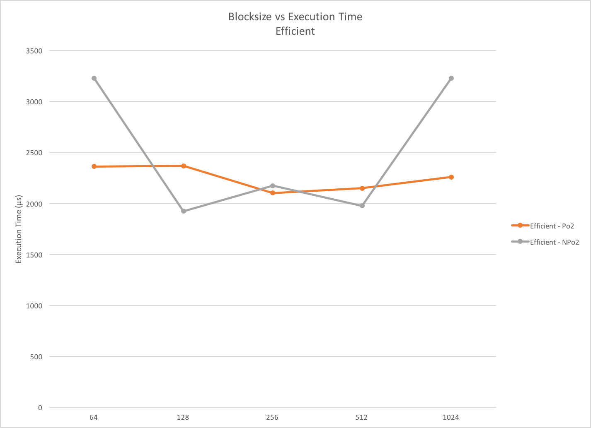
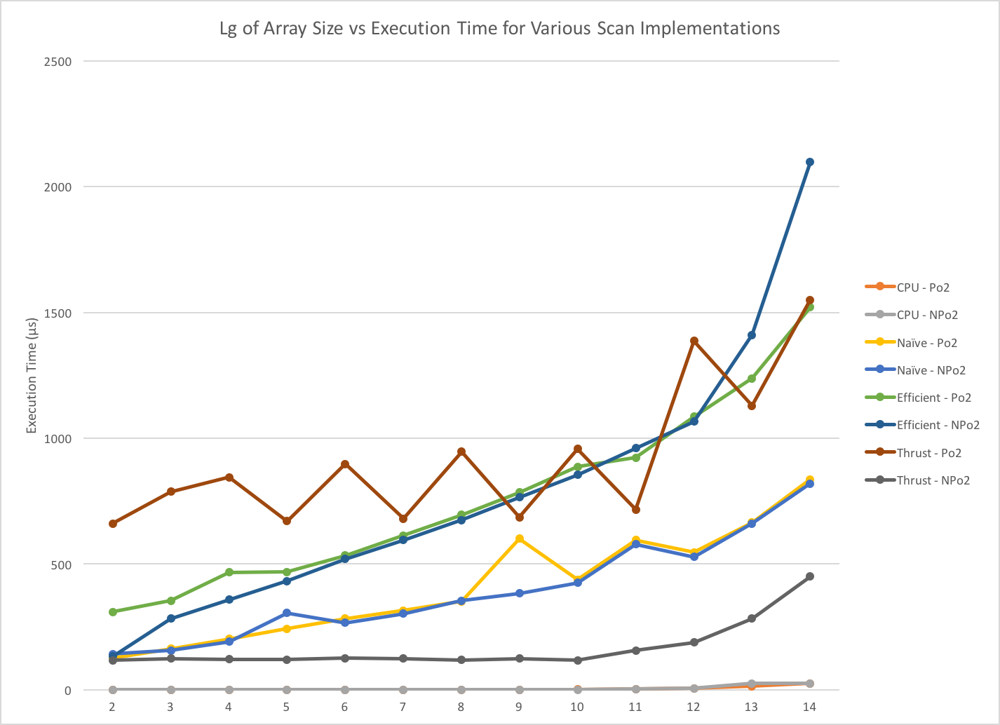

CUDA Stream Compaction
======================

***PAGE UNDER CONSTRUCTION***

**University of Pennsylvania, CIS 565: GPU Programming and Architecture, Project 2**

* Gabriel Naghi
* Tested on: Windows 7, i7-6700 @ 3.70GHz 16GB, Quadro K620 222MB (Moore 100C Lab)

## Overview

In this project, I implemented three Stream Compation algorithms.

Stream compaction is the process of compressing a list of elements, removing any elements 
which don't match some criteria and replacing the "good" elements in their original ordering. 
This algorithm will be useful in the future when dong ray-tracing, where once rays have escaped 
the scene, we no longer need to process them and thus wish to elmiate them from our list.

*Source: Nvidia GPU Gems 3*

This is equivalent to the python dictionary comprehension one-liner:

~~~

output_list = [ elt for elt in input_list if elt != 0 ]

~~~

While this process is easily done in an iterative fashion, we can also employ some parallel algorithms 
to compute the compacted array more quickly. These parallel algorithms require that first a temporary boolean 
mapping of the list must be created, which then undergoes an "exclusive scan". The result of the scan the represents the indices of elements in the output array, which occurs in a simple operation called "scatter."

A "scan" (depicted below) is an operation that creates and ouput list such that for each index an input list, the output list 
contains the sums of all elements preceeding it in the input list. The term "exclusive" means that the first 
element of the output array is always 0, and thus the last element of the input array is excluded. This contrasts 
with an "inclusive" scan, which begins with the first element of the input array.

*Source: CIS565 Lecture Slides*

It is here that we can divide our algorithms into naive and efficientimplementations. For comparison's sake, 
the scan method was also implemented as a CPU function.

For the purposes of our implementation, the criteria for inclusion in the output list in non-zero value.

### CPU Implementation

The CPU implementation functions in the most straightforward way possible. At each index, it simply adds the value at that index plus the preceeding calculated value, much like a fibbonacci sequence. 

The only optimization I was able to make here was that, instead of re-summing all input elements 0 through j-1 to compute 
element j, I simply add input element j-1 to output element j-2. We will see later in performace analysis, however, that
optimizations are inherit to the CPU implementation due to hardware features such as memory caching. 

### Naive Parallel Implementation

*Source: CIS565 Lecture Slides*

As depicted above, the Naive parallel implmentation computes several pairwise adds for each level in 0 to lg n. 

While this limits the number of parallel loops that need to be launched, this algorithm is not considered "work efficient" since the number of additions that must be computed is O(n lgn). 

I optimized this implementation be launching a scan of an array of length 2^15 using different thread counts. The results are depicted below. In this graph and those later, Po2 stands for Power of Two. 

This graph shows that a 256 blocksize has the lowest average runtime, so this is the value I selected for the final analysis. 

### Efficient Parallel Implementation 

The work-efficient scan implementation can be split into two pieces. 

The first part, depicted below, is the "upsweep." Here, by using a binary tree representation of the array, we compute several intermidate vlaues at each leve

*Source: CIS565 Lecture Slides*

Next, we carry out a "downsweep," which swaps some values and accumalates value in necessary locations in the array. 

*Source: CIS565 Lecture Slides*

All in all, this algorithm does O(n) adds on the upsweep and O(n) adds on the downsweep, which together is stil O(n). 

As I did with the naive implementation, I optimized the thread count per block in the efficient implementation. The test results below indicate that the shortest average runtime occurs at 512 threads per block. 

### Thrust Implementation 

Since we don't have the Thrust source code, its really quite hard to tell what precisely it is doing. However, the kernels which are repeated called are:
1. Accumulate Tiles (memcopy?)
2. Exclusive Scan
3. Downsweep. This seems to take elemensts from a couple different algorithms we've seen. I would not be suprised if there is some hybrid algorithm implemented by Thrust. 

## Performance Analysis
Interstingly enough, the CPU implementation completely blew all other implementations out of the water. Indeed, at the lower array sizes, I could hardly get a timing since the algorithm would complete execution before a they system clock would even tick. 

As I alluded to earlier, I think much of the credit here is due to CPU caching. All the memory locations with which we need do deal are both temporally and spatially local, so each index in the array likely needs only a couple instructions to complete, and likely no disk waits. In fact, if the compiler is smart enough, it might even be holding the values we need in registers. Given a Hyperthredded Quad Core CPU running at 3.7 GHz, an array of length 2^15 would finish in quite close to no time at all- which is what we see here.

On the other hand, we see our parallel algorthms lagging behind quite a biut. Nvidia's Thrust implementation is seen working quite well,but only for arrays of size not-power-of-two. Very strage. 

Additionally, our naive implementation is seen crushing our work efficient implementation. I believe this is because the bottleneck here is memory access, which the work efficient implementation does rather a lot of (especially in the add/swap downsweep.) In general, I question how valuable "saving work" is on a GPU, particularly addition, since the devices are so heavily optimized for arithmetic.

## Test Suite Output
~~~
$ ./cis565_stream_compaction_test.exe

****************
** SCAN TESTS **
****************
    [  38  19  38  37   5  47  15  35   0  12   3   0  42 ...   7   0 ]
==== cpu scan, power-of-two ====
    [   0  38  57  95 132 137 184 199 234 234 246 249 249 ... 803684 803691 ]
==== cpu scan, non-power-of-two ====
    [   0  38  57  95 132 137 184 199 234 234 246 249 249 ... 803630 803660 ]
    passed
==== naive scan, power-of-two ====
    passed
==== naive scan, non-power-of-two ====
    passed
==== work-efficient scan, power-of-two ====
    passed
==== work-efficient scan, non-power-of-two ====
    passed
==== thrust scan, power-of-two ====
    passed
==== thrust scan, non-power-of-two ====
    passed

*****************************
** STREAM COMPACTION TESTS **
*****************************
    [   2   3   2   1   3   1   1   1   2   0   1   0   2 ...   3   0 ]
==== cpu compact without scan, power-of-two ====
    [   2   3   2   1   3   1   1   1   2   1   2   1   1 ...   2   3 ]
    passed
==== cpu compact without scan, non-power-of-two ====
    [   2   3   2   1   3   1   1   1   2   1   2   1   1 ...   2   2 ]
    passed
==== cpu compact with scan ====
    [   2   3   2   1   3   1   1   1   2   1   2   1   1 ...   2   3 ]
    passed
==== work-efficient compact, power-of-two ====
    passed
==== work-efficient compact, non-power-of-two ====
    passed
~~~
