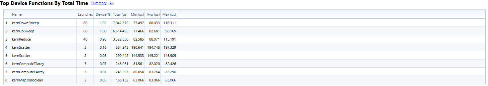
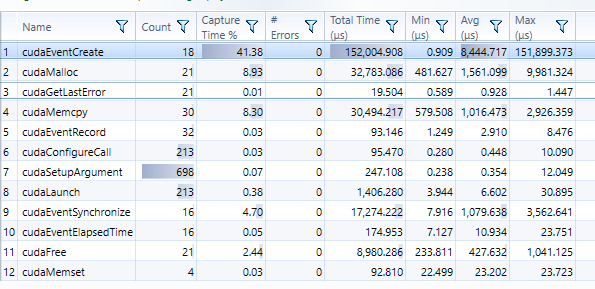
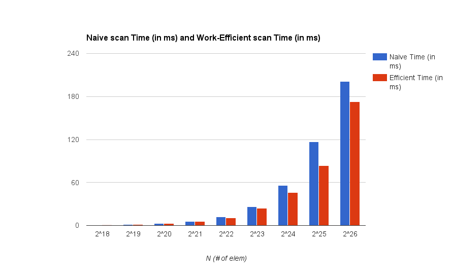
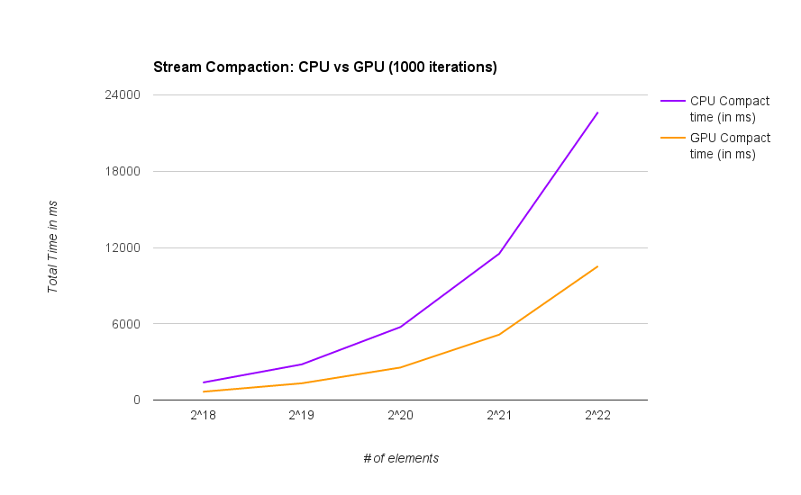
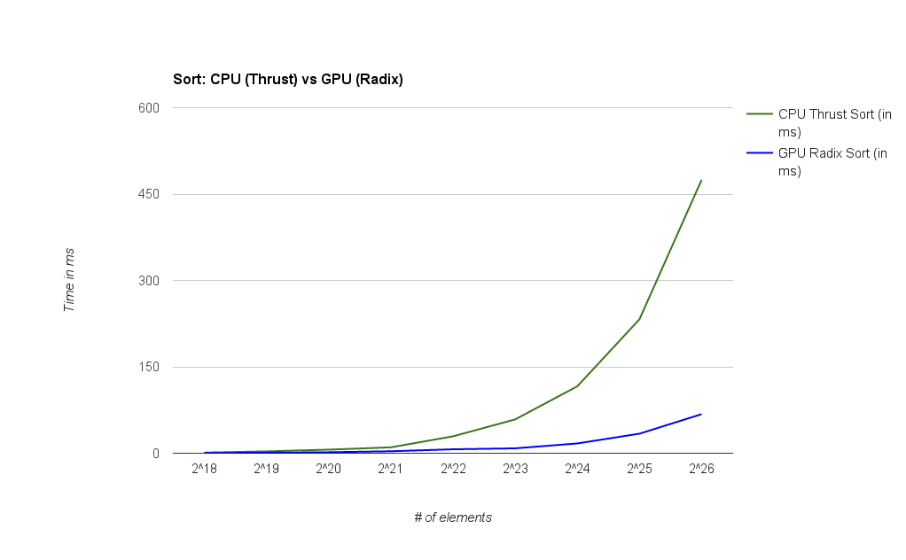

CUDA Stream Compaction
======================

**University of Pennsylvania, CIS 565: GPU Programming and Architecture, Project 2**

* Akshay Shah
* Tested on: Windows 10, i7-5700HQ @ 2.70GHz 16GB, GTX 970M 6GB (Personal Computer)

### Stream Compaction

Block Size: 256

Array input: vary from 2<sup>18</sup> to 2<sup>26</sup>.

Max size: 2<sup>30</sup>

CUDA Summary





Memory I/O looks to be the bottleneck over the GPU, meaning changing the variables over to shared memory might make a difference. (not checked, just speculating)


#### Output
```
****************
** SCAN TESTS **
****************
    [  38  19  38  37   5  47  15  35   0  12   3   0  42 ...  38   0 ]
==== cpu scan, power-of-two ====
215 ms total, average : 215 ms.
==== cpu scan, non-power-of-two ====
    passed
==== naive scan, power-of-two ====
total time to run naive scan, power-of-two: 187.5 in ms, aver: 187.5
    passed
==== naive scan, non-power-of-two ====
    passed
==== work-efficient scan, power-of-two ====
total time to run efficient scan, power-of-two: 171.601 in ms, aver: 171.601
    passed
==== work-efficient scan, non-power-of-two ====
    passed
==== thrust scan, power-of-two ====
49 ms total thrust, average : 49 ms.
    passed
==== thrust scan, non-power-of-two ====
    passed

*****************************
** STREAM COMPACTION TESTS **
*****************************
    [   2   3   2   1   3   1   1   1   2   0   1   0   2 ...   0   0 ]
==== cpu compact without scan, power-of-two ====
182 ms total cpu w/o scan, average : 182 ms.
    [   2   3   2   1   3   1   1   1   2   1   2   1   1 ...   1   1 ]
    passed
==== cpu compact without scan, non-power-of-two ====
    [   2   3   2   1   3   1   1   1   2   1   2   1   1 ...   2   2 ]
    passed
==== cpu compact with scan ====
356 ms total cpu w scan, average : 356 ms.
    [   2   3   2   1   3   1   1   1   2   1   2   1   1 ...   1   1 ]
    passed
==== work-efficient compact, power-of-two ====
total time to run efficient compact, power-of-two: 186.149 in ms, aver: 186.149
    passed
==== work-efficient compact, non-power-of-two ====
    [   2   3   2   1   3   1   1   1   2   1   2   1   1 ...   2   2 ]
    passed

*****************************
** RADIX SORT TESTS **
*****************************
    [   3   5   0   1   0   2   0   1   6   1   1   2   1 ...   0   0 ]
==== radix sort, power-of-two ====
total time to run radix, power-of-two: 67.8532 in ms, aver: 67.8532
    [   0   0   0   0   0   0   0   0   0   0   0   0   0 ...   6   6 ]
==== thrust sort, power-of-two ====
515 ms total thrust sort, average : 515 ms.
```



##### A comparison of Stream Compaction over the GPU vs CPU

The time was measured for 1000 iterations
Exclusive scan was used inside the stream compaction over GPU, which is shown (CPU vs GPU scan) in Fig. 1



##### Radix sort
Implemented Radix sort on the GPU, that uses exclusive scan. The output shows a sorted array.
Limitation to this implementation is that the max digit that can be used for sorting is 7. To increase the digit limit, you would have to change the lsb iteration number in sort.cu to whatever bit is the maximum.
There is a comparison between thrust's CPU sort and this GPU sort.


