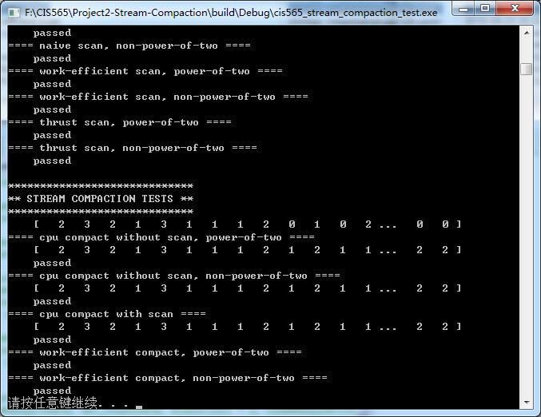
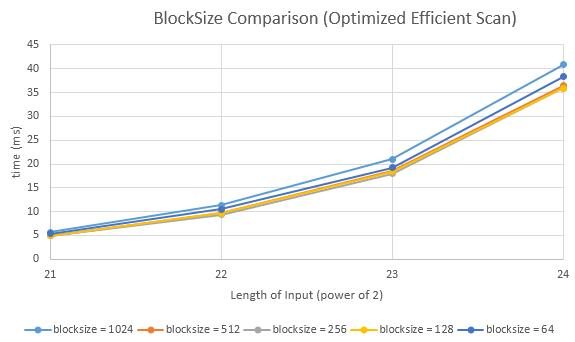

CUDA Stream Compaction
======================

**University of Pennsylvania, CIS 565: GPU Programming and Architecture, Project 2**

* Kaixiang Miao
* Tested on: Windows 7, i7-3630QM @ 2.40GHz 8GB, GTX 660M 2GB (Lenovo Y580 laptop, personal computer)

## Screenshot

All tests passed.

## Performance Analysis

### Scan Comparison

| length of input| cpu scan (ms) | naive scan (ms) | non-optimized efficient scan (ms) | optimized efficient scan (ms) |thrust scan (ms)|
|----------------|---------------|-----------------|-----------------------------------|-------------------------------|----------------|
| 2^10           | 0             | 0.0418          | 0.0882                            | 0.0954                        |0               |
| 2^13           | 0             | 0.0761          | 0.1681                            | 0.1473                        |0               |
| 2^16           | 0             | 0.4851          | 0.9168                            | 0.3155                        |0               |
| 2^19           | 2.0001        | 3.5169          | 7.7984                            | 1.6069                        |1               |
| 2^22           | 33.0019       | 31.4348         | 61.9076                           | 11.3602                       |3.002           |

**non-optimized efficient scan:**
	
	__global__ void CudaUpSweep(int d, int *data, int addTimes)
	{
		int thid = (blockIdx.x * blockDim.x) + threadIdx.x;
		if (thid >= addTimes)
			return;
		int m = 1 << (d + 1);
		if (!(thid % m))
			data[thid + m - 1] += data[thid + (m >> 1) - 1];
	}
	
	__global__ void CudaDownSweep(int d, int *data, int addTimes)
	{
		int thid = (blockIdx.x * blockDim.x) + threadIdx.x;
		if (thid >= addTimes)
			return;
		int m = 1 << (d + 1);
		if (!(thid % m))
		{
			int temp = data[thid + (m >> 1) - 1];
			data[thid + (m >> 1) - 1] = data[thid + m - 1];
			data[thid + m - 1] += temp;
		}
	}

**optimized efficient scan:**

    __global__ void CudaUpSweep(int d, int *data, int addTimes)
	{
		int thid = (blockIdx.x * blockDim.x) + threadIdx.x;
		if (thid >= addTimes)
			return;
		data[(thid + 1) * (1 << (d + 1)) - 1] += data[(thid + 1) * (1 << (d + 1)) - 1 - (1 << d)];
	}
	
	__global__ void CudaDownSweep(int d, int *data, int addTimes)
	{
		int thid = (blockIdx.x * blockDim.x) + threadIdx.x;
		if (thid >= addTimes)
			return;
		int m = (thid + 1) * (1 << (d + 1));
		int temp = data[m - 1 - (1 << d)];
		data[m - 1 - (1 << d)] = data[m - 1];
		data[m - 1] += temp;
	}

### Block Size Comparison

Comparing blocksize = 1024, 512, 256, 128, 64, it seems that *128 <= blocksize <= 512* performs better on my machine.

## Question

- **Roughly optimize the block sizes of each of your implementations for minimal run time on your GPU.**

See Performance Analysis.

- **Compare all of these GPU Scan implementations (Naive, Work-Efficient, and Thrust) to the serial CPU version of Scan. Plot a graph of the comparison (with array size on the independent axis).**

See Performance Analysis.

As mentioned in GPU Gem 3, I guess thrust::exclusive_scan is using shared memory instread of global memory in my implementation. Accessing to shared memory in a block is more efficient than accessing to global memory.

- **Write a brief explanation of the phenomena you see here.**

The problem of non-optimized efficient scan is that lots of threads are doing nothing because we're examining if the index is divisible in the thread. The solution is to eliminate these threads. Actually we're able to access the useful indices of data directly by deducing some formulas using the index of thread.

- **Paste the output of the test program into a triple-backtick block in your README.**

The output of the test program:

	****************
	** SCAN TESTS **
	****************
	    [  38  19  38  37   5  47  15  35   0  12   3   0  42 ...  42   0 ]
	==== cpu scan, power-of-two ====
	    [   0  38  57  95 132 137 184 199 234 234 246 249 249 ... 411089014 41108905
	6 ]
	==== cpu scan, non-power-of-two ====
	    [   0  38  57  95 132 137 184 199 234 234 246 249 249 ... 411088950 41108897
	4 ]
	    passed
	==== naive scan, power-of-two ====
	    passed
	==== naive scan, non-power-of-two ====
	    passed
	==== work-efficient scan, power-of-two ====
	    passed
	==== work-efficient scan, non-power-of-two ====
	    passed
	==== thrust scan, power-of-two ====
	    passed
	==== thrust scan, non-power-of-two ====
	    passed
	
	*****************************
	** STREAM COMPACTION TESTS **
	*****************************
	    [   2   3   2   1   3   1   1   1   2   0   1   0   2 ...   0   0 ]
	==== cpu compact without scan, power-of-two ====
	    [   2   3   2   1   3   1   1   1   2   1   2   1   1 ...   2   2 ]
	    passed
	==== cpu compact without scan, non-power-of-two ====
	    [   2   3   2   1   3   1   1   1   2   1   2   1   1 ...   2   2 ]
	    passed
	==== cpu compact with scan ====
	    [   2   3   2   1   3   1   1   1   2   1   2   1   1 ...   2   2 ]
	    passed
	==== work-efficient compact, power-of-two ====
	    passed
	==== work-efficient compact, non-power-of-two ====
	    passed

## Extra Credits

### Optimized efficient scan

See performance analysis.

### Radix sort

Implemented in radix.h and radix.cu.

	****************
	** RADIX SORT TESTS **
	****************
	==== Radix Sort ====
	Array Size = 256
	Time:0.893440 ms
	Unsorted Array:
	    [ 129  65   3   2 164 225 233  65 163 238   5  32  39 ... 194   0 ]
	Sorted Array:
	    [   0   0   0   0   1   1   2   3   3   5   5   5   6 ... 253 254 ]
	    passed
	
	****************
	** RADIX SORT TESTS **
	****************
	==== Radix Sort ====
	Array Size = 512
	Time:1.707232 ms
	Unsorted Array:
	    [ 359 307 257 255 382 173 233 269 365 470 220   4 277 ... 263   0 ]
	Sorted Array:
	    [   0   1   1   1   3   3   4   4   5   5   6   6   7 ... 510 510 ]
	    passed
	
	****************
	** RADIX SORT TESTS **
	****************
	==== Radix Sort ====
	Array Size = 1024
	Time:2.026848 ms
	Unsorted Array:
	    [ 858 812 768 254 875 147 233 755 850 970 200 1013 780 ... 280   0 ]
	Sorted Array:
	    [   0   0   0   3   4   4   4   5   5   6   8  10  11 ... 1021 1022 ]
	    passed
	
	****************
	** RADIX SORT TESTS **
	****************
	==== Radix Sort ====
	Array Size = 2048
	Time:1.603968 ms
	Unsorted Array:
	    [ 852 809 768 1277 866 134 233 1766 837 1988 190 2030 776 ...   6   0 ]
	Sorted Array:
	    [   0   0   0   2   3   6   6   6   8   8   9  10  12 ... 2046 2046 ]
	    passed
	
	****************
	** RADIX SORT TESTS **
	****************
	==== Radix Sort ====
	Array Size = 4096
	Time:2.233344 ms
	Unsorted Array:
	    [ 849 2855 768 1277 2909 2175 233 1760 2878 4033 185 2027 774 ... 432   0 ]
	Sorted Array:
	    [   0   0   0   1   2   3   6   7   8   9   9   9  11 ... 4093 4094 ]
	    passed
	
	****************
	** RADIX SORT TESTS **
	****************
	==== Radix Sort ====
	Array Size = 8192
	Time:3.248928 ms
	Unsorted Array:
	    [ 4943 6950 768 1277 2907 2172 233 1757 2875 4032 4278 6121 773 ... 5148   0
	 ]
	Sorted Array:
	    [   0   0   0   1   1   3   3   5   5   7   7   7   8 ... 8189 8189 ]
	    passed
	
	****************
	** RADIX SORT TESTS **
	****************
	==== Radix Sort ====
	Array Size = 16384
	Time:3.312192 ms
	Unsorted Array:
	    [ 13134 6950 768 1277 2906 10362 233 9947 11065 12223 4277 14312 8964 ... 53
	62   0 ]
	Sorted Array:
	    [   0   1   1   1   1   2   3   4   5   5   6   6   7 ... 16382 16382 ]
	    passed
	
	****************
	** RADIX SORT TESTS **
	****************
	==== Radix Sort ====
	Array Size = 32768
	Time:4.561664 ms
	Unsorted Array:
	    [ 13134 6950 768 1277 19289 26745 233 26330 27448 12223 20660 14312 8964 ...
	 18084   0 ]
	Sorted Array:
	    [   0   0   0   1   1   1   2   4   5   7   7   7   8 ... 32764 32765 ]
	    passed
	
	****************
	** RADIX SORT TESTS **
	****************
	==== Radix Sort ====
	Array Size = 65536
	Time:6.343616 ms
	Unsorted Array:
	    [ 13134 6950 768 1277 19289 26745 233 26330 27448 12223 20660 14312 8964 ...
	 27145   0 ]
	Sorted Array:
	    [   0   0   1   1   1   1   1   1   2   2   2   4   4 ... 32767 32767 ]
	    passed
	
	****************
	** RADIX SORT TESTS **
	****************
	==== Radix Sort ====
	Array Size = 131072
	Time:10.497824 ms
	Unsorted Array:
	    [ 13134 6950 768 1277 19289 26745 233 26330 27448 12223 20660 14312 8964 ...
	 12498   0 ]
	Sorted Array:
	    [   0   0   1   1   1   1   1   1   1   1   1   1   2 ... 32767 32767 ]
	    passed
	
	****************
	** RADIX SORT TESTS **
	****************
	==== Radix Sort ====
	Array Size = 262144
	Time:17.427200 ms
	Unsorted Array:
	    [ 13134 6950 768 1277 19289 26745 233 26330 27448 12223 20660 14312 8964 ...
	 15972   0 ]
	Sorted Array:
	    [   0   0   0   0   0   1   1   1   1   1   1   1   1 ... 32767 32767 ]
	    passed
	
	****************
	** RADIX SORT TESTS **
	****************
	==== Radix Sort ====
	Array Size = 524288
	Time:32.032894 ms
	Unsorted Array:
	    [ 13134 6950 768 1277 19289 26745 233 26330 27448 12223 20660 14312 8964 ...
	 22920   0 ]
	Sorted Array:
	    [   0   0   0   0   0   0   0   0   0   0   0   0   0 ... 32767 32767 ]
	    passed
	
	****************
	** RADIX SORT TESTS **
	****************
	==== Radix Sort ====
	Array Size = 1048576
	Time:61.234879 ms
	Unsorted Array:
	    [ 13134 6950 768 1277 19289 26745 233 26330 27448 12223 20660 14312 8964 ...
	 4048   0 ]
	Sorted Array:
	    [   0   0   0   0   0   0   0   0   0   0   0   0   0 ... 32767 32767 ]
	    passed
	
	****************
	** RADIX SORT TESTS **
	****************
	==== Radix Sort ====
	Array Size = 2097152
	Time:122.582626 ms
	Unsorted Array:
	    [ 13134 6950 768 1277 19289 26745 233 26330 27448 12223 20660 14312 8964 ...
	 31840   0 ]
	Sorted Array:
	    [   0   0   0   0   0   0   0   0   0   0   0   0   0 ... 32767 32767 ]
	    passed
	
	****************
	** RADIX SORT TESTS **
	****************
	==== Radix Sort ====
	Array Size = 4194304
	Time:232.911423 ms
	Unsorted Array:
	    [ 13138 17699 18632 25340 29604 30672 3346 23402 11192 6075 20512 14356 3110
	2 ... 20531   0 ]
	Sorted Array:
	    [   0   0   0   0   0   0   0   0   0   0   0   0   0 ... 32767 32767 ]
	    passed
	
	****************
	** RADIX SORT TESTS **
	****************
	==== Radix Sort ====
	Array Size = 8388608
	Time:438.904877 ms
	Unsorted Array:
	    [ 13138 17699 18632 25340 29604 30672 3346 23402 11192 6075 20512 14356 3110
	2 ... 17267   0 ]
	Sorted Array:
	    [   0   0   0   0   0   0   0   0   0   0   0   0   0 ... 32767 32767 ]
	    passed
	
	****************
	** RADIX SORT TESTS **
	****************
	==== Radix Sort ====
	Array Size = 16777216
	Time:875.574402 ms
	Unsorted Array:
	    [ 13144 6428 21592 7931 17465 5758 9571 17548 11447 26547 20216 14444 9844 .
	.. 9561   0 ]
	Sorted Array:
	    [   0   0   0   0   0   0   0   0   0   0   0   0   0 ... 32767 32767 ]
	    passed
