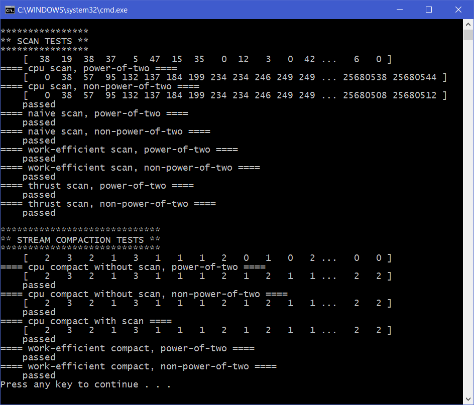
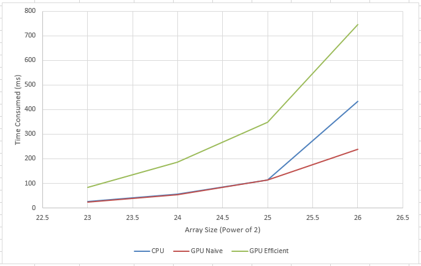
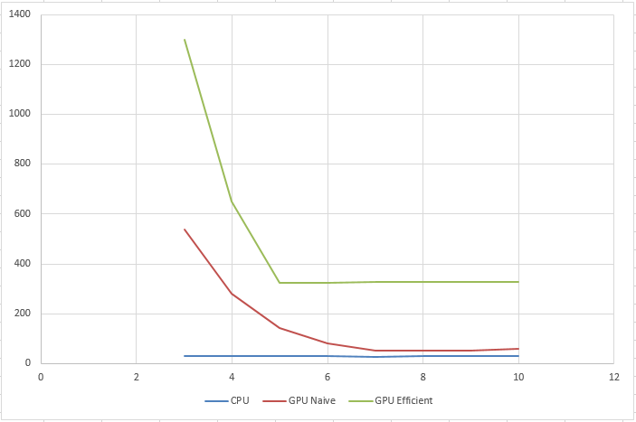

# University of Pennsylvania, CIS 565: GPU Programming and Architecture
## Project 2 - Stream Compaction
* Liang Peng
* Tested on: Windows 10, i7-6700HQ @ 2.6GHz, 8GB, GTX 960M (Personal Computer)

## Screenshots
* Result
 </img>

## Analysis
* Time measurement with std::chrono
<blockquote>
high_resolution_clock::time_point t1; 
kernel<<<..., ...>>>(...); 
cudaDeviceSynchronize(); 
high_resolution_clock::time_point t2; 
duration t = t2 - t1; 
print t.count(); 
</blockquote>

* Array size
 </img>
  * _Observation_ CPU implementation is always faster than GPU implementation, the reason might be there is considerable overhead in the GPU implementation. My speculation is that as the scan process goes to next level, number of idling threads increases, which can be optimized by removing idle threads before launching kernel for next level. With this approach, index for threads to access elements in array must be recalculated properly.
  
* Block size 
 </img>
  * _Observation_ As block size increases, time consumed to perform scan decreases and at some point stablizes. The reason is the analyzed in last project.
