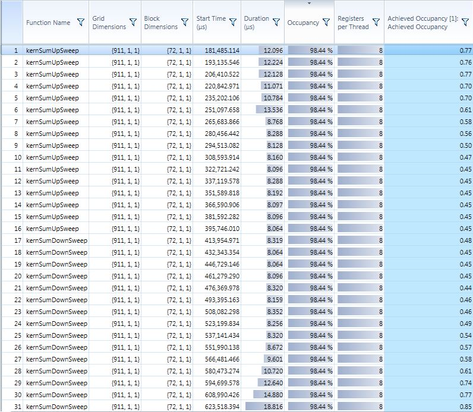
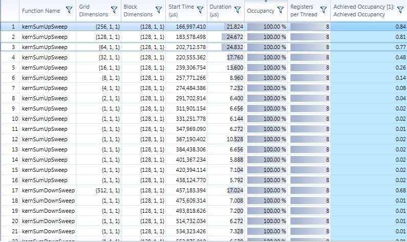
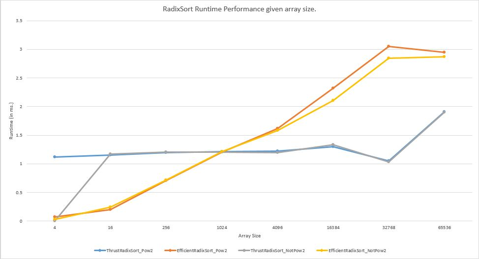
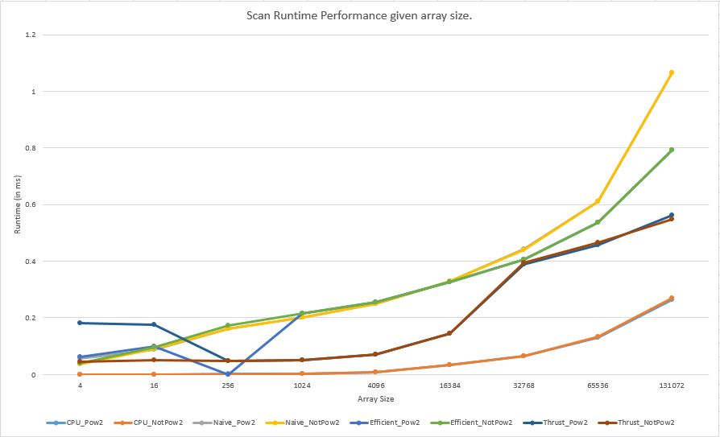
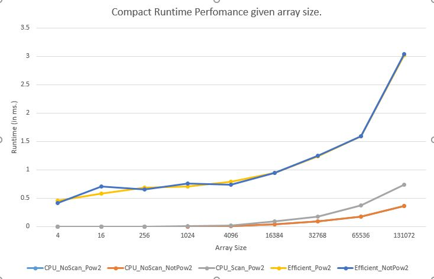

# University of Pennsylvania, CIS 565: GPU Programming and Architecture.
Project 2 CUDA: Stream Compaction
====================

## User resources
- **Name:** David Grosman.
- **Tested on:** Microsoft Windows 7 Professional, i7-5600U @ 2.6GHz, 256GB, GeForce 840M (Personal laptop).

## Project description
This Project's purpose was to gain some experience writing parallel algorithms using CUDA kernels, using them, and analyzing their performance.
I implemented several GPU Scan implementations (Naive, Work-Efficient, and Thrust) and stream compaction methods using these GPU Scan algorithms. I also implemented the same functionality on the CPU as a base-line and easy way to verify all my GPU implementations returned the expected output. As an extra-credit, I improved the performance of my Work-efficient Scan algorithm and also implemented RadixSort on the GPU which I then compared to Thrust's version.
Finally, I implemented a simple Timer which supports both CUDA (through CUDA events) and cpp (through the C++11 std::chrono API ) code.

## Extra-Credit
I implemented all extra-credit given for this Project.

###Why is my GPU approach so slow?
I first implemented my efficient scan version following the class slides closely but I was unsatisfied with its performance -- it was around 8 times slower than my cpu approach.

Looking at the above NSight Report, I noticed that most threads were stalled and they used up the CUDA scheduler. I then noticed that the Scan version is actually composed of two phases: one Up-Sweep followed by one Down-Sweep method. In the Up-Sweep method, the number of threads actually used is decreasing by a factor of two for each iteration, similarly the Down-Sweep method increases the number of threads used by a factor of two for each iteration. As the algorithm was already taking into account the cluster size at each frame, I just needed to call kernSumUpSweep and kernSumDownSweep as follows:
``` C++
int d = 0;
for (; d < maxDepth; ++d)
{
  const size_t clusterSize = 1 << (d + 1);
	const size_t numThreads = (n >= clusterSize) ? n / clusterSize : n;

	dim3 fullBlocksPerGrid((numThreads + blockSize - 1) / blockSize);
	kernSumUpSweep << <fullBlocksPerGrid, blockSize >> >(n, clusterSize, cudaBuffer);
}

cudaMemset(cudaBuffer + (n - 1), 0, sizeof(int));
for (; d >= 0; --d)
{
	const size_t clusterSize = 1 << (d + 1);
	const size_t numThreads = (n >= clusterSize) ? n / clusterSize : n;
   
	dim3 fullBlocksPerGrid((numThreads + blockSize - 1) / blockSize);
	kernSumDownSweep << <fullBlocksPerGrid, blockSize >> >(n, clusterSize, cudaBuffer);
}
```
I also had to set the following in both functions' kernels body in order to fetch the wanted memory:
```
const unsigned long iThreadIdx = clusterSize * ( threadIdx.x + (blockIdx.x * blockDim.x) );
```

The improved efficient GPU scan gave me the following NSight report:


### Radix Sort
I added radix.h and radix.cu to the stream_compaction subproject where I implemented radix sort using my efficient scan implementation. I tested it using the same format as the provided UnitTests and got it to work with arrays of up to 65536 random integers. I also compared it to the performance of Thrust's radix sort implementation and here are the results:



It is interesting to notice that the performance of the Thrust's method is constant whereas my version is faster for smaller arrays and much slower for bigger inputs. It would have been nice to run the algorithm on bigger inputs since they might converge again at some point. 

Note that my radix sort's function declaration is similar to all other functions implemented in this project:
```C++
void StreamCompaction::RadixSort::sort(int n, int *odata, const int *idata);
```

---
### Performance Analysis
Note that the following statistics have been captured by calling the given functions 1000 times (with the default parameters given when starting the project) and averaging the results.
Please note that I used CUDA events for timing GPU code and I did not include any initial/final memory operations (cudaMalloc, cudaMemcpy) in your performance measurements, for comparability.


It is interesting to notice that the CPU version is the fastest. It is most probably due to the fact that the algorithm on CPU is O(n) and accessing contiguous memory on CPU is very fast compared to GPU. The performance time on GPU decreases much faster given a bigger array size. It confirms that memory access is the GPU's performance main bottleneck.
It is nice to see that the efficient-scan performs better than the Naive implementation, even though it doesn't outperform Thrust's version which might include more efficient tricks.



---
### Test Program Output
```C++
****************
** TESTS INFO **
****************

ArraySize = 65536; ArrayOddSize: 65533
****************
** SCAN TESTS **
****************
    [  38  19  38  37   5  47  15  35   0  12   3   0  42 ...  35   0 ]
==== cpu scan, power-of-two ====
    [   0  38  57  95 132 137 184 199 234 234 246 249 249 ... 1604374 1604409 ]
(null) - Elapsed Time:0.139000 ms.
==== cpu scan, non-power-of-two ====
    [   0  38  57  95 132 137 184 199 234 234 246 249 249 ... 1604305 1604316 ]
    passed
(null) - Elapsed Time:0.129000 ms.
==== naive scan, power-of-two ====
    passed
(null) - Elapsed Time:0.609576 ms.
==== naive scan, non-power-of-two ====
    passed
(null) - Elapsed Time:0.609687 ms.
==== work-efficient scan, power-of-two ====
    passed
(null) - Elapsed Time:0.535494 ms.
==== work-efficient scan, non-power-of-two ====
    passed
(null) - Elapsed Time:0.535663 ms.
==== thrust scan, power-of-two ====
    passed
(null) - Elapsed Time:0.466199 ms.
==== thrust scan, non-power-of-two ====
    passed
(null) - Elapsed Time:0.478206 ms.

*****************************
** STREAM COMPACTION TESTS **
*****************************
    [   2   3   2   1   3   1   1   1   2   0   1   0   2 ...   1   0 ]
==== cpu compact without scan, power-of-two ====
    [   2   3   2   1   3   1   1   1   2   1   2   1   1 ...   1   1 ]
    passed
(null) - Elapsed Time:0.178000 ms.
==== cpu compact without scan, non-power-of-two ====
    [   2   3   2   1   3   1   1   1   2   1   2   1   1 ...   3   1 ]
    passed
(null) - Elapsed Time:0.177000 ms.
==== cpu compact with scan ====
    [   2   3   2   1   3   1   1   1   2   1   2   1   1 ...   1   1 ]
    passed
(null) - Elapsed Time:0.374000 ms.
==== work-efficient compact, power-of-two ====
    passed
(null) - Elapsed Time:1.581446 ms.
==== work-efficient compact, non-power-of-two ====
    passed
(null) - Elapsed Time:1.613630 ms.

*****************************
** RADIX SORT TESTS **
*****************************
    [  38 7719 21238 2437 8855 11797 8365 32285 10450 30612 5853 28100 1142 ...
15085   0 ]
==== thrust radix-sort, power-of-two ====
    [   0   1   1   1   1   2   2   2   3   3   4   4   4 ... 32766 32767 ]
(null) - Elapsed Time:1.960000 ms.
==== my radix-sort, power-of-two ====
    passed
(null) - Elapsed Time:3.173000 ms.
==== thrust radix-sort, non-power-of-two ====
    [   1   1   1   1   2   2   2   3   3   4   4   4   4 ... 32766 32767 ]
(null) - Elapsed Time:1.901000 ms.
==== my radix-sort, non-power-of-two ====
    passed
(null) - Elapsed Time:3.126000 ms.
```


