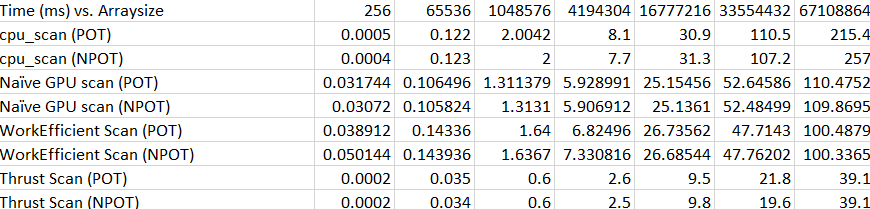
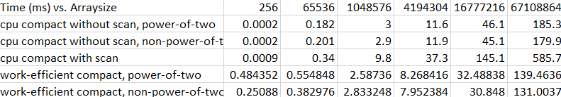

CUDA Stream Compaction
======================

**University of Pennsylvania, CIS 565: GPU Programming and Architecture, Project 2**

* Xiang Deng
* Tested on:  Windows 10-Home, i7-6700U @ 2.6GHz 16GB, GTX 1060 6GB (Personal Computer)

 
* Compare all of these GPU Scan implementations (Naive, Work-Efficient, and Thrust) to the serial CPU version of Scan. Plot a graph of the comparison (with array size on the independent axis).
(The following are the results for timing vs. varing arraysize with blocksize=128)




Based on the figure and data above, regarding scanning, I found the breakpoint for GPU outperforms the GPU is around the arraysize of 2^16, after which the GPU sigificantly speed up than the CPU.
The CPU shows its adavantage for small arraysize.




Based on the figure and data above, regarding compacting, I found the breakpoint for GPU outperforms the GPU is between the arraysize of 2^16 and 2^20, after which the GPU sigificantly speed up than the CPU.
The CPU still shows its adavantage for small arraysize.

# Regarding "bottlenecks" :

Firstly we didn't observe significant improvement from Naive GPU scanning to Efficient Scanning, one possible reasoning that might shed light on this is the 
increasing number of sleeping threads as the levels of the balance tree grows higher.

The memory transfer between CPU and GPU also slows down the performance, one possible way to alleviate this problem might be increasing the data size which reduces the
percentage of such overhead in the meanwhile.

The switching between the upsweeping and downsweeping trigerrs new kernels to be established, which could be more efficient if the kernels could be reused.


* Optimization of blocksize:
Experiments was conducted on various blocksizes from 32 to 1024 with exponential growth. Typically we observed the optimizal value of block size (256) which best 
balance the optimal value of scan time as well as compact time for GPU. Since earlier we observed the array size of 2^16 is around the "turning poit", we 
used this parameter for the tuning of the blocksize.


* Extra credits
* 1) I typically found arraysize of 2^16 or greater already makes the GPU outforms the GPU.
* 2) The radix sort was implemented and tested. The testing function (at the end of the main.cpp) generates array size of power of two and not power of two. In both cases,
we compare the sorting result with C++ built in sorting function to verify the correctness. It's correctness has been verified.

# Test output

```
****************
** SCAN TESTS **
****************
    [  38  19  38  37   5  47  15  35   0  12   3   0  42 ...   6   0 ]
==== cpu scan, power-of-two ====
    [   0  38  57  95 132 137 184 199 234 234 246 249 249 ... 25680538 25680544 ]
time lapsed 2.110000 ms
==== cpu scan, non-power-of-two ====
    [   0  38  57  95 132 137 184 199 234 234 246 249 249 ... 25680508 25680512 ]
    passed
time lapsed 2.130000 ms
==== naive scan, power-of-two ====
    [   0  38  57  95 132 137 184 199 234 234 246 249 249 ... 25680538 25680544 ]
    passed
time lapsed 1.296384 ms
==== naive scan, non-power-of-two ====
    [   0  38  57  95 132 137 184 199 234 234 246 249 249 ...   0   0 ]
    passed
time lapsed 1.291712 ms
==== work-efficient scan, power-of-two ====
    [   0  38  57  95 132 137 184 199 234 234 246 249 249 ... 25680538 25680544 ]
    passed
time lapsed 1.671008 ms
==== work-efficient scan, non-power-of-two ====
    [   0  38  57  95 132 137 184 199 234 234 246 249 249 ... 25680508 25680512 ]
    passed
time lapsed 1.668096 ms
==== thrust scan, power-of-two ====
    [   0  38  57  95 132 137 184 199 234 234 246 249 249 ... 25680538 25680544 ]
    passed
time lapsed 0.630000 ms
==== thrust scan, non-power-of-two ====
    [   0  38  57  95 132 137 184 199 234 234 246 249 249 ... 25680508 25680512 ]
    passed
time lapsed 0.620000 ms

*****************************
** STREAM COMPACTION TESTS **
*****************************
    [   2   3   2   1   3   1   1   1   2   0   1   0   2 ...   0   0 ]
==== cpu compact without scan, power-of-two ====
    [   2   3   2   1   3   1   1   1   2   1   2   1   1 ...   2   2 ]
    passed
time lapsed 3.060000 ms
==== cpu compact without scan, non-power-of-two ====
    [   2   3   2   1   3   1   1   1   2   1   2   1   1 ...   2   2 ]
    passed
time lapsed 3.110000 ms
==== cpu compact with scan ====
    [   2   3   2   1   3   1   1   1   2   1   2   1   1 ...   2   2 ]
    passed
time lapsed 9.810000 ms
==== work-efficient compact, power-of-two ====
    [   2   3   2   1   3   1   1   1   2   1   2   1   1 ...   2   2 ]
    passed
time lapsed 2.623488 ms
==== work-efficient compact, non-power-of-two ====
    [   2   3   2   1   3   1   1   1   2   1   2   1   1 ...   2   2 ]
    passed
time lapsed 2.942464 ms

*****************************
** RADIX SORT TESTS **
*****************************
==== Array to be sorted power of 2 ====
    [  38 119  38  37  55 197 165  85  50  12  53 100 142 ...  56   0 ]
==== RADIX SORT POT ====
size of int is 32 bits
    [   0   0   0   0   0   0   0   0   0   0   0   0   0 ... 199 199 ]
==== C++ SORT POT ====
    [   0   0   0   0   0   0   0   0   0   0   0   0   0 ... 199 199 ]
    passed
==== Array to be sorted not power of 2 ====
    [  38 1719 1238 437 855 1797 365 285 450 612 1853 100 1142 ... 656   0 ]
==== RADIX SORT NPOT ====
size of int is 32 bits
    [   0   0   0   0   0   0   0   0   0   0   0   0   0 ... 1999 1999 ]
==== C++ SORT NPOT ====
    [   0   0   0   0   0   0   0   0   0   0   0   0   0 ... 1999 1999 ]
    passed
```

## Note
### Modified files
CMakeList.txt : add radixSort.h and radixSort.cu, changed -arch=sm_20 to sm_61
Two files added: radixSort.h and radixSort.cu