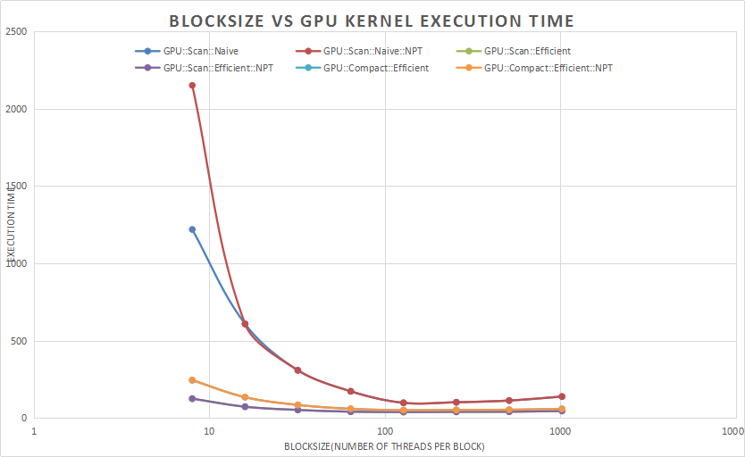
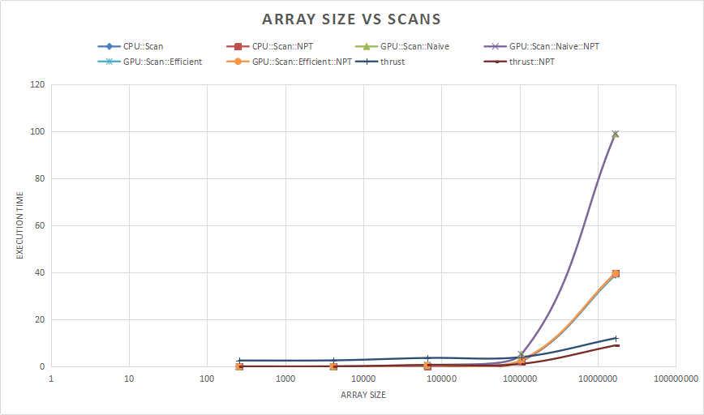
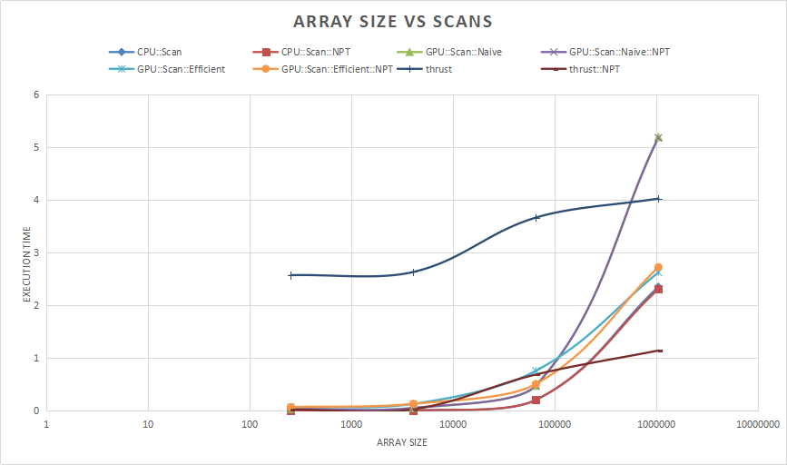
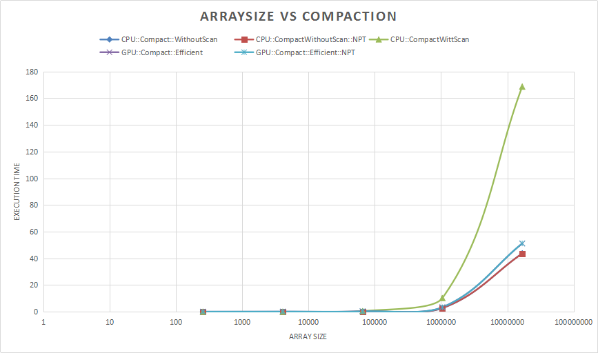
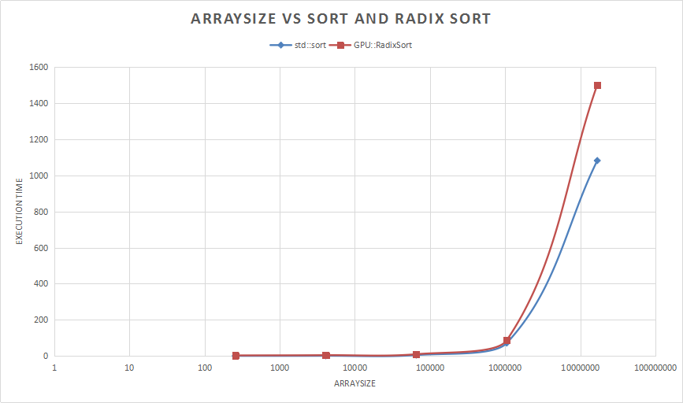

CUDA Stream Compaction
======================

**University of Pennsylvania, CIS 565: GPU Programming and Architecture, Project 2**

* Zimeng Yang
* Tested on: Windows 10, i7-4850 @ 2.3GHz 16GB, GT 750M (Personal Laptop)

## Overview 


## Features
* Scan
  * CPU Scan
  * GPU Naive Scan
  * GPU Work efficient Scan
* Compaction
  * CPU Compaction with/without Scan
  * GPU Work efficient Compaction
* GPU Radix Sort

## Performance Analysis
For following performance analysis, execution time is calculated by averaging several executions. The original output of each piece of collected/recorded data can be found under `/test_datas/BlockSize*_SIZE*.txt`.

* for recording CPU time: 

```
cpu_timer_start = std::chrono::high_resolution_clock::now(); 
......
cpu_timer_stop = std::chrono::high_resolution_clock::now();
std::chrono::duration<double, std::milli> duration = cpu_timer_stop - cpu_timer_start;
```
* for recording GPU time: 

```
cudaEventRecord(gpu_timer_start);
......
cudaEventRecord(gpu_timer_stop);
cudaEventSynchronize(gpu_timer_stop);
	
cudaEventElapsedTime(&elapsedTime, gpu_timer_start, gpu_timer_stop);
```

Unit of measurements: `ms`

### Find an Optimized BlockSize for Each Implementation

From above chart, for each implementation, the optimized block_size is around 128. Small block size (less than 16) will cause serious performance penalties. When block size is higher than 128, performance cannot continue obtaining any improvement whith the increase of block size, and performance will drop off for large block size.

SO, for the following test, BLOCK_SIZE is set to `128`.

### Performance Comparison of Scan

And for a detailed chart:


With the increase of array size, thrust achives the slowest increase of execution time. CPu and GPU implementations' performance will suffer from the increase the array size. 

In my computer, GPU implementation is slower than CPU impelmentation. WOrk-efficient GPU implemenetation is much faster than naive GPU scan.

Non-power-of-two array size will introduce some decrease of performance for GPU implementation.

|array size|CPU     |GPU-Naive|GPU-work efficient|GPU-work efficient NPT|
|----      |----    |----     |----              |----                  |
|256       |0       |0.031    |0.066             |0.065                 |
|4096      |0       |0.051    |0.127             |0.128                 |
|65536     |0.203   |0.472    |0.754             |0.504                 |
|1048576   |2.347   |5.187    |2.62              |2.72                  |
|16777216  |38.904  |98.854   |39.102            |39.471                |

### Performance Comparison for Compaction

Work-efficient implementation is much faster than naive compaction. 

Non-power-of-tow array size have trivial imfluence on both gpu and cpu.

GPU implementation is slower than cpu without scan implementation, but much faster than cpu with scan.

|array size|CPU-no-scan     |CPU-with-Scan|GPU-work efficient|GPU-work efficient NPT|
|----      |----            |----         |----              |----                  |
|256       |0               |0            |0.086             |0.085                 |
|4096      |0               |0            |0.142             |0.138                 |
|65536     |0.203           |0.503        |0.339             |0.340                 |
|1048576   |2.747           |10.289       |3.397             |3.373                 |
|16777216  |43.708          |168.675      |51.127            |51.203                |

### Performance Comparison for Radix Sort and Std::sort


For extra, I implementated Radix Sort, compared with std::sort, radix sort is slower than std::sort.

Execution time increases almost linearly for Radix Sort.

|array size|CPU-no-scan     |CPU-with-Scan|
|----      |----            |----         |
|256       |0               |2.772        |
|4096      |0.499           |4.067        |
|65536     |4.519           |9.379        |
|1048576   |71.374          |86.858       |
|16777216  |1082.067        |1502.197     |

## Example Output
Copy and paste from one execution:

```

**********************
**  TEST PARAMETERS **
**********************
        Array size = 16777216
        BlockSize  = 128


****************
** SCAN TESTS **
****************
    [  38  19  38  37   5  47  15  35   0  12   3   0  42 ...  42   0 ]
==== cpu scan, power-of-two ====
<==TIMER==> Scan::CPU =  38.904 ms <==TIMER==>
    [   0  38  57  95 132 137 184 199 234 234 246 249 249 ... 411089014 411089056 ]

==== cpu scan, non-power-of-two ====
<==TIMER==> Scan::CPU =  39.604 ms <==TIMER==>
    [   0  38  57  95 132 137 184 199 234 234 246 249 249 ... 411088950 411088974 ]
    passed

==== naive scan, power-of-two ====
<==TIMER==> Scan::GPU::Naive =  98.854 ms <==TIMER==>
    passed

==== naive scan, non-power-of-two ====
<==TIMER==> Scan::GPU::Naive =  98.863 ms <==TIMER==>
    passed

==== work-efficient scan, power-of-two ====
<==TIMER==> Scan::GPU::Efficient =  39.102 ms <==TIMER==>
    passed

==== work-efficient scan, non-power-of-two ====
<==TIMER==> Scan::GPU::Efficient =  39.471 ms <==TIMER==>
    passed

==== thrust scan, power-of-two ====
<==TIMER==> Scan::Thrust =  12.047 ms <==TIMER==>
    passed

==== thrust scan, non-power-of-two ====
<==TIMER==> Scan::Thrust =  8.977 ms <==TIMER==>
    passed


*****************************
** STREAM COMPACTION TESTS **
*****************************
    [   2   3   2   1   3   1   1   1   2   0   1   0   2 ...   0   0 ]
==== cpu compact without scan, power-of-two ====
<==TIMER==> Compact::CPU::WithoutScan =  43.708 ms <==TIMER==>
    [   2   3   2   1   3   1   1   1   2   1   2   1   1 ...   2   2 ]
    passed

==== cpu compact without scan, non-power-of-two ====
<==TIMER==> Compact::CPU::WithoutScan =  43.631 ms <==TIMER==>
    [   2   3   2   1   3   1   1   1   2   1   2   1   1 ...   2   2 ]
    passed

==== cpu compact with scan ====
<==TIMER==> Compact::CPU::WithScan =  168.657 ms <==TIMER==>
    [   2   3   2   1   3   1   1   1   2   1   2   1   1 ...   2   2 ]
    passed

==== work-efficient compact, power-of-two ====
<==TIMER==> Compact::GPU::Efficient =  51.127 ms <==TIMER==>
    passed

==== work-efficient compact, non-power-of-two ====
<==TIMER==> Compact::GPU::Efficient =  51.203 ms <==TIMER==>
    passed


*****************************
****** RADIX SORT TESTS *****
*****************************
    [  38 7719 21238 2437 8855 11797 8365 32285 10450 30612 5853 28100 1142 ... 7792 2304 ]
==== std::sort ====
<==TIMER==> CPU::std::sort =  1082.067 ms <==TIMER==>
    [   0   0   0   0   0   0   0   0   0   0   0   0   0 ... 32767 32767 ]

==== GPU::RadixSort ====
<==TIMER==> GPU::Radix Sort =  1502.197 ms <==TIMER==>
    passed

Press any key to continue . . .
```
