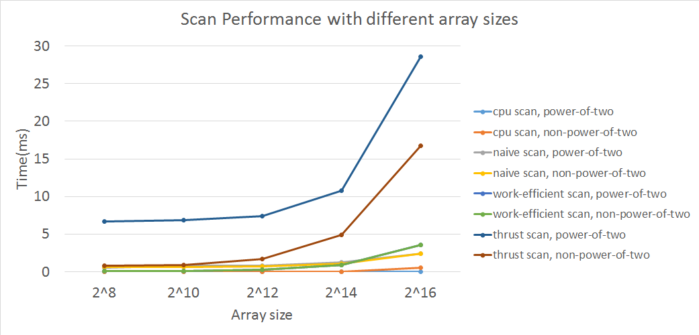
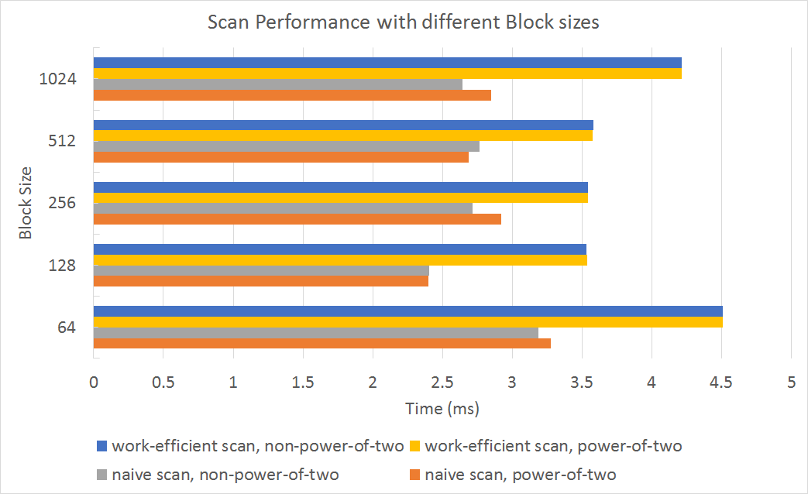
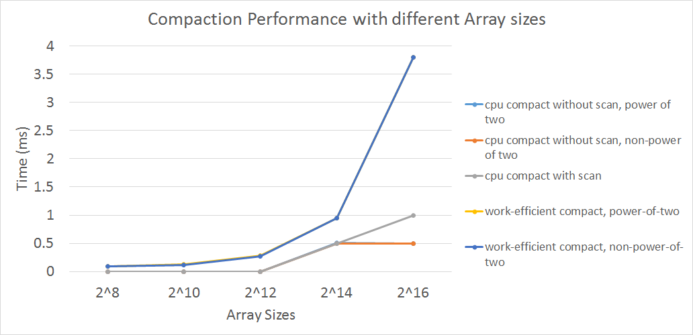
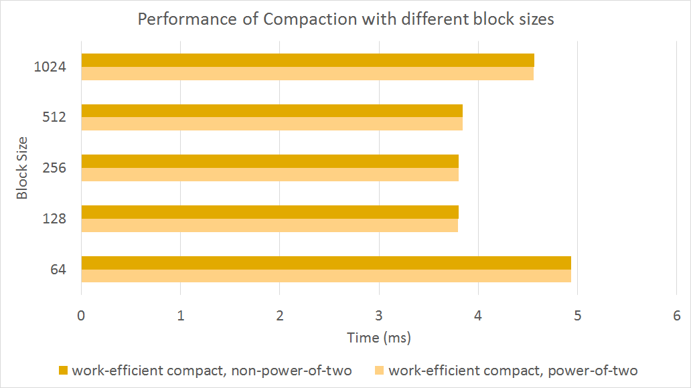
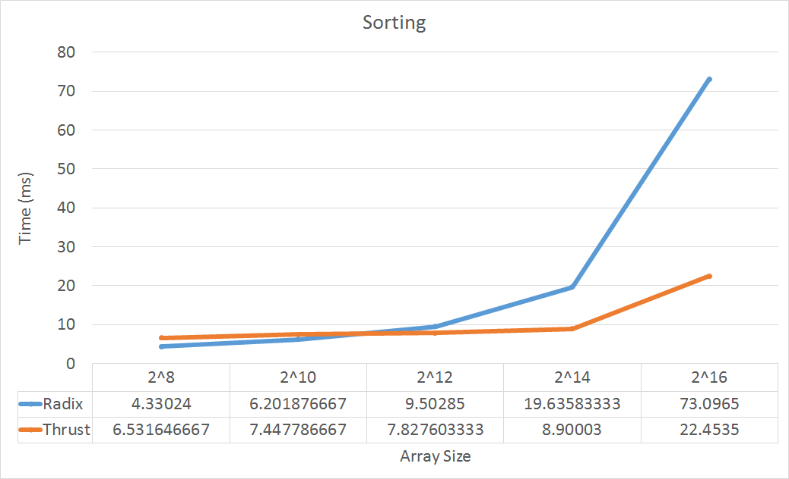

CUDA Stream Compaction
======================

**University of Pennsylvania, CIS 565: GPU Programming and Architecture, Project 2**

* Nischal K N
* Tested on: Windows 10, i7-2670QM @ 2.20GHz 8GB, GTX 540 2GB (Personal)

### SUMMARY
This project implements scan, stream compaction and sorting algorithms implemented on GPU and its performance compared against a CPU implementation. Two kinds of exclusive scans are implemented, viz., naive and efficient. Stream compaction is implemented using the efficient GPU scan implementation. Additionally Radix sort is also implemented using efficient stream compaction. The performance of these algorithms are measured against CPU and thrust implementations and are documented in Analysis section.

### BUILD
* To setup cuda development environment use [this guide](https://github.com/nischalkn/Project0-CUDA-Getting-Started/blob/master/INSTRUCTION.md#part-1-setting-up-your-development-environment)
* Once the environment is set up, to Build and run the project follow [this](https://github.com/nischalkn/Project0-CUDA-Getting-Started/blob/master/INSTRUCTION.md#part-3-build--run)

### PARAMETERS
* `SIZE` - Size of array to be scanned, compacted and sorted
* `PROFILE` - `1` or `0`, Print execution times

### PERFORMANCE ANALYSIS
The time taken to perform exclusive scans on arrays of different sizes ranging from `2^8` or `2^16` were recorded with a fixed block size of `128` (program crashed for array sizes beyond `2^16`). It was seen that the time taken by the CPU was very small to be recorded accurately for small array sizes but would increase exponentially as the array size increases. It is also seen that the naive scan outperforms work-efficient scan at larger array sizes because of the overhead of upsweep and downsweep steps which increase logarithmically with increase in array size. Most of the threads do not do any work in the extreme stages of the upsweep and downsweep. Many threads are launched but do not perform any work. This overhead causes a dramatic increase in execution time. It was also observed that the thrust implementation consistently was the slowest.

An other experiment was conducted with various block sizes for a constant array length of `2^16`. It is seen that the best performance is obtained with a block size of `128`.

CPU compactions for array sizes less than `2^14` take negligible amount of time. The work-efficient compactions is the slowest because of the same reason as mentioned above. A number of threads are launched which do not do any work.

Again running the compactions on different block sizes result in a best block size of `128`.

A radix sort was implemented using the work-efficient scan and its performance was compared with the `thrust::sort`. It was seen that for small array sizes, the radix sort outperforms thrust sort. But however as the array size increases, the work-efficient scan becomes slow as explained above and reduces the effciency of sorting algorithm.


### FUTURE IMPROVEMENTS
* Work-efficient scan can be optimized to reduce the number of threads launched at each stage of upsweep and downsweep process.
* Early termination of threads would also improve the scan performance.

### OUTPUT
```

****************
** SCAN TESTS **
****************
    [  38  19  38  37   5  47  15  35   0  12   3   0  42 ...  35   0 ]
==== cpu scan, power-of-two ====
    [   0  38  57  95 132 137 184 199 234 234 246 249 249 ... 1604374 1604409 ]
==== cpu scan, non-power-of-two ====
    [   0  38  57  95 132 137 184 199 234 234 246 249 249 ... 1604305 1604316 ]
    passed
==== naive scan, power-of-two ====
    [   0  38  57  95 132 137 184 199 234 234 246 249 249 ... 1604374 1604409 ]
    passed
==== naive scan, non-power-of-two ====
    [   0  38  57  95 132 137 184 199 234 234 246 249 249 ...   0   0 ]
    passed
==== work-efficient scan, power-of-two ====
    [   0  38  57  95 132 137 184 199 234 234 246 249 249 ... 1604374 1604409 ]
    passed
==== work-efficient scan, non-power-of-two ====
    [   0  38  57  95 132 137 184 199 234 234 246 249 249 ... 1604305 1604316 ]
    passed
==== thrust scan, power-of-two ====
    [   0  38  57  95 132 137 184 199 234 234 246 249 249 ... 1604374 1604409 ]
    passed
==== thrust scan, non-power-of-two ====
    [   0  38  57  95 132 137 184 199 234 234 246 249 249 ... 1604305 1604316 ]
    passed

*****************************
** STREAM COMPACTION TESTS **
*****************************
    [   2   3   2   1   3   1   1   1   2   0   1   0   2 ...   1   0 ]
==== cpu compact without scan, power-of-two ====
    [   2   3   2   1   3   1   1   1   2   1   2   1   1 ...   1   1 ]
    passed
==== cpu compact without scan, non-power-of-two ====
    [   2   3   2   1   3   1   1   1   2   1   2   1   1 ...   3   1 ]
    passed
==== cpu compact with scan ====
    [   2   3   2   1   3   1   1   1   2   1   2   1   1 ...   1   1 ]
    passed
==== work-efficient compact, power-of-two ====
    [   2   3   2   1   3   1   1   1   2   1   2   1   1 ...   1   1 ]
    passed
==== work-efficient compact, non-power-of-two ====
    [   2   3   2   1   3   1   1   1   2   1   2   1   1 ...   3   1 ]
    passed

*****************************
***** RADIX SORT TESTS ******
*****************************
==== thrust sort small array ====
    [   0   1   2   3   4   5   6   7   8   9 ]
==== Radix Sort small array ====
    [   0   1   2   3   4   5   6   7   8   9 ]
    passed
==== thrust sort large array ====
    [   0   0   0   0   0   0   0   0   0   0   0   0   0 ... 199 199 ]
==== Radix Sort large array ====
    [   0   0   0   0   0   0   0   0   0   0   0   0   0 ... 199 199 ]
    passed
```

### MODIFICATIONS
* 4 tests are added to the main function for sorting. 2 test to sort an array using `thrust::sort` and 2 tests to sort the array using `StreamCompaction::radixSort`.
* CMakeLists.txt of StreamCompaction was edited to include `radixSort.h` and	`radixSort.cu`.
