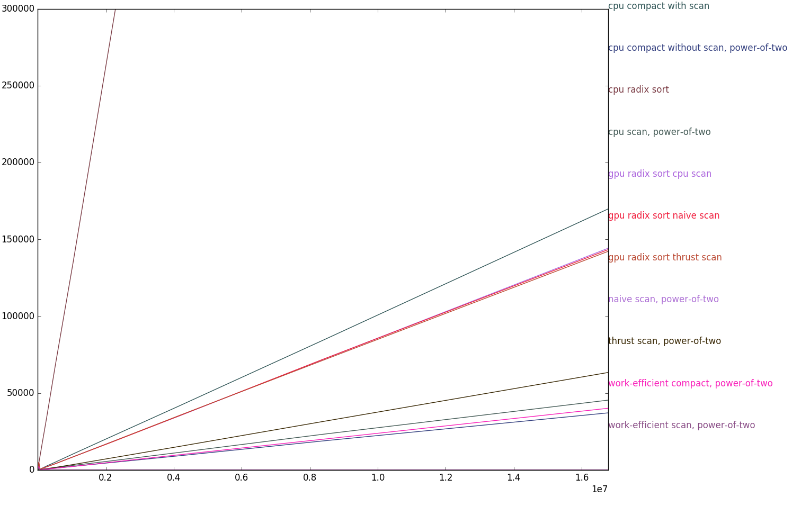
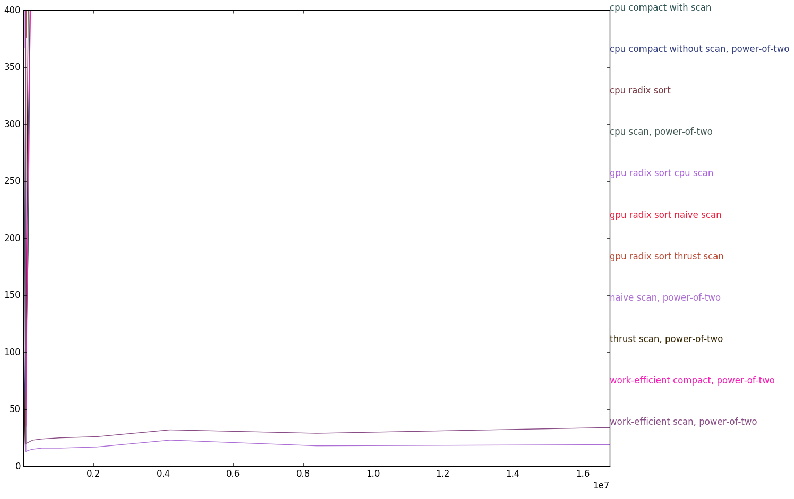
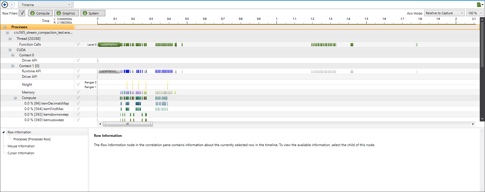
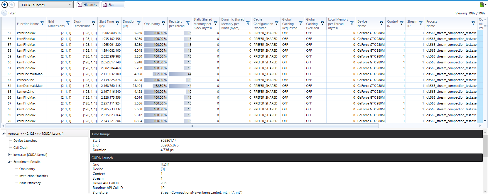

CUDA Stream Compaction
======================

**University of Pennsylvania, CIS 565: GPU Programming and Architecture, Project 2**

* (TODO) Rony Edde (redde)
* Tested on: Windows 10, i7-6700k @ 4.00GHz 64GB, GTX 980M 8GB (Personal Laptop)

### (TODO: Your README)

Include analysis, etc. (Remember, this is public, so don't put
anything here that you don't want to share with the world.)


This is an implementation of scan and reduce on the CPU and GPU
for stream compaction.
There are 2 types of arrays to consider.  Powers of 2 and non
powers of 2 which are part of the test.

* Scan
  * The first method used is on the CPU where all elements are
  added using a for loop.  This works very well on small arrays.

  * The second method consists of using the GPU to compute the
  scan result.  This is a naive implementation where the first
  iteration copies elements left to right (exclusive), then 
  2^(i+1) for a depth of log2(n).  Each depth skips 2^(d-1).
  This is faster than the CPU version for large arrays.

  * The third method uses a double sweep.  An upsweep, followed by
  a downsweep using a balanced tree form.  Each sweeps takes 
  log2(n-1) iterations but the calls on the GPU are only taking
  place on multiples of 2^(d+1).  This should be fast because
  there are only O(n) adds for the up sweep and O(n) adds and
  O(n) swaps.

  * Thrust scan uses CUDA's thrust exclusive function which is 
  built in the CUDA library.

* Stream Compaction
  * The first implementation is on the CPU where a for loop looks
  for values greater than 0 and adds them to the new array while
  incrementing the count when a non zero value is found.

  * The second implementation uses the CPU but also uses the scan
  function to look up indices.

  * The third implementation uses the GPU to generate a [0 1] 
  mapped array which is then run into the scan GPU function
  and used as an index lookup for placing the elements.
  After the scan function all non zero elements will be 
  present wich will result in a compact array with no zeros.


* Thrust 
  * The implementation is mentionned in the Scan section.

* Radix sort
  * There are 2 versions of the Radix sort.  This first one runs
  on the CPU using a CPU version on scan.

  * The second version uses the GPU to run the scan.  It also uses
  a GPU function to determine the max number in the array.  This
  is used to determine how many loops are needed before we reach
  the maximum amount of decimals in the maximum number.
  Another GPU function is used to shift the scan from exclusive
  to inclusive which is needed for a correct radix sort.
  There are multiple scan functions that can be used, a few are
  benchmarked.

* Benchmarks
  * Running benhmarks on a range of 256 to 65536 with a power of 4
  increment gave the following results:


```

****************
** SCAN TESTS **
****************
    [  38  19  38  37   5  47  15  35   0  12   3   0  42 ...  26   0 ]
==== cpu scan, power-of-two ====
    [   0  38  57  95 132 137 184 199 234 234 246 249 249 ... 6203 6229 ]
==== cpu scan, non-power-of-two ====
    [   0  38  57  95 132 137 184 199 234 234 246 249 249 ... 6146 6190 ]
    passed
==== naive scan, power-of-two ====
    [   0  38  57  95 132 137 184 199 234 234 246 249 249 ... 6203 6229 ]
    passed
==== naive scan, non-power-of-two ====
    [   0  38  57  95 132 137 184 199 234 234 246 249 249 ...   0   0 ]
    passed
==== work-efficient scan, power-of-two ====
    passed
==== work-efficient scan, non-power-of-two ====
    passed
==== thrust scan, power-of-two ====
    passed
==== thrust scan, non-power-of-two ====
    passed
==== cpu radix sort ====
    [   0   0   0   0   0   0   1   1   1   1   2   2   2 ...  49  49 ]
    passed
==== gpu radix sort cpu scan ====
    [   0   0   0   0   0   0   1   1   1   1   2   2   2 ...  49  49 ]
    passed
==== gpu radix sort naive scan ====
    [   0   0   0   0   0   0   1   1   1   1   2   2   2 ...  49  49 ]
    passed
==== gpu radix sort thrust scan ====
    [   0   0   0   0   0   0   1   1   1   1   2   2   2 ...  49  49 ]
    passed

*****************************
** STREAM COMPACTION TESTS **
*****************************
    [   2   3   2   1   3   1   1   1   2   0   1   0   2 ...   0   0 ]
==== cpu compact without scan, power-of-two ====
    [   2   3   2   1   3   1   1   1   2   1   2   1   1 ...   2   1 ]
    passed
==== cpu compact without scan, non-power-of-two ====
    [   2   3   2   1   3   1   1   1   2   1   2   1   1 ...   3   2 ]
    passed
==== cpu compact with scan ====
    [   2   3   2   1   3   1   1   1   2   1   2   1   1 ...   2   1 ]
    passed
==== work-efficient compact, power-of-two ====
    expected 190 elements, got 0
    FAIL COUNT
==== work-efficient compact, non-power-of-two ====
    expected 189 elements, got -1
    FAIL COUNT

****************
** BENCHMARKS **
****************

** SIZE = 256 **
****************
    [  38  19  38  37   5  47  15  35   0  12   3   0  42 ...  26   0 ]
==== cpu scan, power-of-two ====
Time:  0 microSeconds
==== naive scan, power-of-two ====
Time:  549 microSeconds
==== work-efficient scan, power-of-two ====
Time:  650 microSeconds
==== thrust scan, power-of-two ====
Time:  1 microSeconds
==== cpu radix sort ====
Time:  35 microSeconds
==== gpu radix sort cpu scan ====
Time:  1301 microSeconds
==== gpu radix sort naive scan ====
Time:  1116 microSeconds
==== gpu radix sort thrust scan ====
Time:  959 microSeconds
==== cpu compact without scan, power-of-two ====
Time:  0 microSeconds
==== cpu compact with scan ====
Time:  1 microSeconds
==== work-efficient compact, power-of-two ====
Time:  823 microSeconds

** SIZE = 512 **
****************
    [  38  19  38  37   5  47  15  35   0  12   3   0  42 ...  11   0 ]
==== cpu scan, power-of-two ====
Time:  0 microSeconds
==== naive scan, power-of-two ====
Time:  663 microSeconds
==== work-efficient scan, power-of-two ====
Time:  624 microSeconds
==== thrust scan, power-of-two ====
Time:  1 microSeconds
==== cpu radix sort ====
Time:  66 microSeconds
==== gpu radix sort cpu scan ====
Time:  1936 microSeconds
==== gpu radix sort naive scan ====
Time:  2750 microSeconds
==== gpu radix sort thrust scan ====
Time:  1743 microSeconds
==== cpu compact without scan, power-of-two ====
Time:  0 microSeconds
==== cpu compact with scan ====
Time:  3 microSeconds
==== work-efficient compact, power-of-two ====
Time:  732 microSeconds

** SIZE = 1024 **
****************
    [  38  19  38  37   5  47  15  35   0  12   3   0  42 ...  40   0 ]
==== cpu scan, power-of-two ====
Time:  1 microSeconds
==== naive scan, power-of-two ====
Time:  590 microSeconds
==== work-efficient scan, power-of-two ====
Time:  591 microSeconds
==== thrust scan, power-of-two ====
Time:  7 microSeconds
==== cpu radix sort ====
Time:  142 microSeconds
==== gpu radix sort cpu scan ====
Time:  1857 microSeconds
==== gpu radix sort naive scan ====
Time:  2996 microSeconds
==== gpu radix sort thrust scan ====
Time:  1893 microSeconds
==== cpu compact without scan, power-of-two ====
Time:  1 microSeconds
==== cpu compact with scan ====
Time:  5 microSeconds
==== work-efficient compact, power-of-two ====
Time:  839 microSeconds

** SIZE = 2048 **
****************
    [  38  19  38  37   5  47  15  35   0  12   3   0  42 ...  32   0 ]
==== cpu scan, power-of-two ====
Time:  2 microSeconds
==== naive scan, power-of-two ====
Time:  522 microSeconds
==== work-efficient scan, power-of-two ====
Time:  563 microSeconds
==== thrust scan, power-of-two ====
Time:  6 microSeconds
==== cpu radix sort ====
Time:  270 microSeconds
==== gpu radix sort cpu scan ====
Time:  1920 microSeconds
==== gpu radix sort naive scan ====
Time:  2679 microSeconds
==== gpu radix sort thrust scan ====
Time:  2020 microSeconds
==== cpu compact without scan, power-of-two ====
Time:  3 microSeconds
==== cpu compact with scan ====
Time:  12 microSeconds
==== work-efficient compact, power-of-two ====
Time:  936 microSeconds

** SIZE = 4096 **
****************
    [  38  19  38  37   5  47  15  35   0  12   3   0  42 ...  24   0 ]
==== cpu scan, power-of-two ====
Time:  5 microSeconds
==== naive scan, power-of-two ====
Time:  616 microSeconds
==== work-efficient scan, power-of-two ====
Time:  574 microSeconds
==== thrust scan, power-of-two ====
Time:  7 microSeconds
==== cpu radix sort ====
Time:  542 microSeconds
==== gpu radix sort cpu scan ====
Time:  2560 microSeconds
==== gpu radix sort naive scan ====
Time:  2989 microSeconds
==== gpu radix sort thrust scan ====
Time:  1920 microSeconds
==== cpu compact without scan, power-of-two ====
Time:  7 microSeconds
==== cpu compact with scan ====
Time:  25 microSeconds
==== work-efficient compact, power-of-two ====
Time:  756 microSeconds

** SIZE = 8192 **
****************
    [  38  19  38  37   5  47  15  35   0  12   3   0  42 ...   4   0 ]
==== cpu scan, power-of-two ====
Time:  11 microSeconds
==== naive scan, power-of-two ====
Time:  585 microSeconds
==== work-efficient scan, power-of-two ====
Time:  649 microSeconds
==== thrust scan, power-of-two ====
Time:  18 microSeconds
==== cpu radix sort ====
Time:  1134 microSeconds
==== gpu radix sort cpu scan ====
Time:  3575 microSeconds
==== gpu radix sort naive scan ====
Time:  3091 microSeconds
==== gpu radix sort thrust scan ====
Time:  2307 microSeconds
==== cpu compact without scan, power-of-two ====
Time:  16 microSeconds
==== cpu compact with scan ====
Time:  50 microSeconds
==== work-efficient compact, power-of-two ====
Time:  1070 microSeconds

** SIZE = 16384 **
****************
    [  38  19  38  37   5  47  15  35   0  12   3   0  42 ...  26   0 ]
==== cpu scan, power-of-two ====
Time:  23 microSeconds
==== naive scan, power-of-two ====
Time:  577 microSeconds
==== work-efficient scan, power-of-two ====
Time:  605 microSeconds
==== thrust scan, power-of-two ====
Time:  20 microSeconds
==== cpu radix sort ====
Time:  2146 microSeconds
==== gpu radix sort cpu scan ====
Time:  3037 microSeconds
==== gpu radix sort naive scan ====
Time:  3576 microSeconds
==== gpu radix sort thrust scan ====
Time:  2925 microSeconds
==== cpu compact without scan, power-of-two ====
Time:  33 microSeconds
==== cpu compact with scan ====
Time:  100 microSeconds
==== work-efficient compact, power-of-two ====
Time:  844 microSeconds

** SIZE = 32768 **
****************
    [  38  19  38  37   5  47  15  35   0  12   3   0  42 ...   7   0 ]
==== cpu scan, power-of-two ====
Time:  47 microSeconds
==== naive scan, power-of-two ====
Time:  694 microSeconds
==== work-efficient scan, power-of-two ====
Time:  754 microSeconds
==== thrust scan, power-of-two ====
Time:  47 microSeconds
==== cpu radix sort ====
Time:  4261 microSeconds
==== gpu radix sort cpu scan ====
Time:  4030 microSeconds
==== gpu radix sort naive scan ====
Time:  4914 microSeconds
==== gpu radix sort thrust scan ====
Time:  3990 microSeconds
==== cpu compact without scan, power-of-two ====
Time:  69 microSeconds
==== cpu compact with scan ====
Time:  208 microSeconds
==== work-efficient compact, power-of-two ====
Time:  1207 microSeconds

** SIZE = 65536 **
****************
    [  38  19  38  37   5  47  15  35   0  12   3   0  42 ...  35   0 ]
==== cpu scan, power-of-two ====
Time:  93 microSeconds
==== naive scan, power-of-two ====
Time:  940 microSeconds
==== work-efficient scan, power-of-two ====
Time:  818 microSeconds
==== thrust scan, power-of-two ====
Time:  98 microSeconds
==== cpu radix sort ====
Time:  8601 microSeconds
==== gpu radix sort cpu scan ====
Time:  7525 microSeconds
==== gpu radix sort naive scan ====
Time:  8306 microSeconds
==== gpu radix sort thrust scan ====
Time:  6993 microSeconds
==== cpu compact without scan, power-of-two ====
Time:  141 microSeconds
==== cpu compact with scan ====
Time:  433 microSeconds
==== work-efficient compact, power-of-two ====
Time:  1798 microSeconds

** SIZE = 131072 **
****************
    [  38  19  38  37   5  47  15  35   0  12   3   0  42 ...  10   0 ]
==== cpu scan, power-of-two ====
Time:  188 microSeconds
==== naive scan, power-of-two ====
Time:  1005 microSeconds
==== work-efficient scan, power-of-two ====
Time:  1091 microSeconds
==== thrust scan, power-of-two ====
Time:  416 microSeconds
==== cpu radix sort ====
Time:  17129 microSeconds
==== gpu radix sort cpu scan ====
Time:  13022 microSeconds
==== gpu radix sort naive scan ====
Time:  13967 microSeconds
==== gpu radix sort thrust scan ====
Time:  12753 microSeconds
==== cpu compact without scan, power-of-two ====
Time:  283 microSeconds
==== cpu compact with scan ====
Time:  1063 microSeconds
==== work-efficient compact, power-of-two ====
Time:  1239 microSeconds

** SIZE = 262144 **
****************
    [  38  19  38  37   5  47  15  35   0  12   3   0  42 ...  42   0 ]
==== cpu scan, power-of-two ====
Time:  721 microSeconds
==== naive scan, power-of-two ====
Time:  15 microSeconds
==== work-efficient scan, power-of-two ====
Time:  23 microSeconds
==== thrust scan, power-of-two ====
Time:  803 microSeconds
==== cpu radix sort ====
Time:  34138 microSeconds
==== gpu radix sort cpu scan ====
Time:  2116 microSeconds
==== gpu radix sort naive scan ====
Time:  1984 microSeconds
==== gpu radix sort thrust scan ====
Time:  1934 microSeconds
==== cpu compact without scan, power-of-two ====
Time:  574 microSeconds
==== cpu compact with scan ====
Time:  2539 microSeconds
==== work-efficient compact, power-of-two ====
Time:  526 microSeconds

** SIZE = 524288 **
****************
    [  38  19  38  37   5  47  15  35   0  12   3   0  42 ...  42   0 ]
==== cpu scan, power-of-two ====
Time:  1419 microSeconds
==== naive scan, power-of-two ====
Time:  16 microSeconds
==== work-efficient scan, power-of-two ====
Time:  24 microSeconds
==== thrust scan, power-of-two ====
Time:  1655 microSeconds
==== cpu radix sort ====
Time:  68891 microSeconds
==== gpu radix sort cpu scan ====
Time:  4096 microSeconds
==== gpu radix sort naive scan ====
Time:  4054 microSeconds
==== gpu radix sort thrust scan ====
Time:  4088 microSeconds
==== cpu compact without scan, power-of-two ====
Time:  1170 microSeconds
==== cpu compact with scan ====
Time:  5083 microSeconds
==== work-efficient compact, power-of-two ====
Time:  1042 microSeconds

** SIZE = 1048576 **
****************
    [  38  19  38  37   5  47  15  35   0  12   3   0  42 ...   6   0 ]
==== cpu scan, power-of-two ====
Time:  2930 microSeconds
==== naive scan, power-of-two ====
Time:  19 microSeconds
==== work-efficient scan, power-of-two ====
Time:  29 microSeconds
==== thrust scan, power-of-two ====
Time:  3526 microSeconds
==== cpu radix sort ====
Time:  139318 microSeconds
==== gpu radix sort cpu scan ====
Time:  8460 microSeconds
==== gpu radix sort naive scan ====
Time:  8464 microSeconds
==== gpu radix sort thrust scan ====
Time:  8501 microSeconds
==== cpu compact without scan, power-of-two ====
Time:  2303 microSeconds
==== cpu compact with scan ====
Time:  10349 microSeconds
==== work-efficient compact, power-of-two ====
Time:  2256 microSeconds

** SIZE = 2097152 **
****************
    [  38  19  38  37   5  47  15  35   0  12   3   0  42 ...   2   0 ]
==== cpu scan, power-of-two ====
Time:  5807 microSeconds
==== naive scan, power-of-two ====
Time:  21 microSeconds
==== work-efficient scan, power-of-two ====
Time:  26 microSeconds
==== thrust scan, power-of-two ====
Time:  7438 microSeconds
==== cpu radix sort ====
Time:  280777 microSeconds
==== gpu radix sort cpu scan ====
Time:  17523 microSeconds
==== gpu radix sort naive scan ====
Time:  17809 microSeconds
==== gpu radix sort thrust scan ====
Time:  17854 microSeconds
==== cpu compact without scan, power-of-two ====
Time:  4527 microSeconds
==== cpu compact with scan ====
Time:  20800 microSeconds
==== work-efficient compact, power-of-two ====
Time:  4844 microSeconds

** SIZE = 4194304 **
****************
    [  38  19  38  37   5  47  15  35   0  12   3   0  42 ...  26   0 ]
==== cpu scan, power-of-two ====
Time:  11709 microSeconds
==== naive scan, power-of-two ====
Time:  19 microSeconds
==== work-efficient scan, power-of-two ====
Time:  37 microSeconds
==== thrust scan, power-of-two ====
Time:  17569 microSeconds
==== cpu radix sort ====
Time:  563471 microSeconds
==== gpu radix sort cpu scan ====
Time:  35961 microSeconds
==== gpu radix sort naive scan ====
Time:  35283 microSeconds
==== gpu radix sort thrust scan ====
Time:  35645 microSeconds
==== cpu compact without scan, power-of-two ====
Time:  9153 microSeconds
==== cpu compact with scan ====
Time:  41391 microSeconds
==== work-efficient compact, power-of-two ====
Time:  9657 microSeconds

** SIZE = 8388608 **
****************
    [  38  19  38  37   5  47  15  35   0  12   3   0  42 ...  10   0 ]
==== cpu scan, power-of-two ====
Time:  23157 microSeconds
==== naive scan, power-of-two ====
Time:  19 microSeconds
==== work-efficient scan, power-of-two ====
Time:  33 microSeconds
==== thrust scan, power-of-two ====
Time:  31014 microSeconds
==== cpu radix sort ====
Time:  1125423 microSeconds
==== gpu radix sort cpu scan ====
Time:  71306 microSeconds
==== gpu radix sort naive scan ====
Time:  72187 microSeconds
==== gpu radix sort thrust scan ====
Time:  71193 microSeconds
==== cpu compact without scan, power-of-two ====
Time:  18687 microSeconds
==== cpu compact with scan ====
Time:  83991 microSeconds
==== work-efficient compact, power-of-two ====
Time:  19679 microSeconds

** SIZE = 16777216 **
****************
    [  38  19  38  37   5  47  15  35   0  12   3   0  42 ...  42   0 ]
==== cpu scan, power-of-two ====
Time:  45688 microSeconds
==== naive scan, power-of-two ====
Time:  20 microSeconds
==== work-efficient scan, power-of-two ====
Time:  32 microSeconds
==== thrust scan, power-of-two ====
Time:  63120 microSeconds
==== cpu radix sort ====
Time:  2234690 microSeconds
==== gpu radix sort cpu scan ====
Time:  144521 microSeconds
==== gpu radix sort naive scan ====
Time:  141110 microSeconds
==== gpu radix sort thrust scan ====
Time:  140133 microSeconds
==== cpu compact without scan, power-of-two ====
Time:  37891 microSeconds
==== cpu compact with scan ====
Time:  147074 microSeconds
==== work-efficient compact, power-of-two ====
Time:  38434 microSeconds
Press any key to continue . . .
```

* Large scale results:


* Small scale results:



The significance is obvious between the CPU and GPU
implementations.  When looking at small arrays, the
CPU seems to take an interesting advantage.  However
on large arrays, the CPU implementations scale very
poorly, hence the need to have 2 graph scales.
Radix sort suffers particularly when running on the 
CPU.  One pattern that emerges is that the naive
and efficient methods scale logarithmically.
The efficient version was a fraction slower and that
is due to interrupts between the up and downscan.
Every time upscan is called, memory has to be
allocated and copied, the same happens with downscan
This is shown in the last figure.  Despite that,
the loss is minumal.
Thrust scan does well and scales linearly albeit not
as good as the naive and efficient methods.
One thing that was interesting to note is that radix
benefitted more from the thrust scan than the other
GPU implementations.  Again possibly due to the 
multiple GPU functions.  The max number function is
run on the GPU and memory is copied back and forth.
One bottleneck that manifests itself in the graph
below is from the kernDecimalsMap function.
Not enough resources are used during this function
which created a bottleneck that is minimal but not
desired.  About 40% og the GPU is not used.
This is very obvious when looking at the following
timeline and the kernDecimalsMap function:
* Cuda memory calls frequency:



* DecimalsMap bottleneck:



