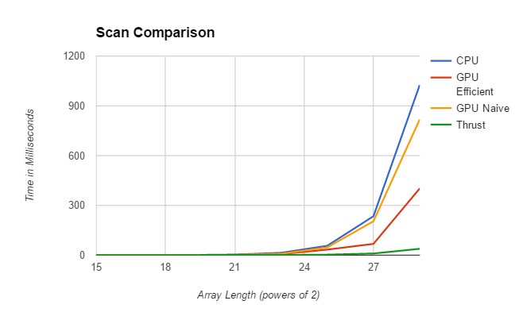
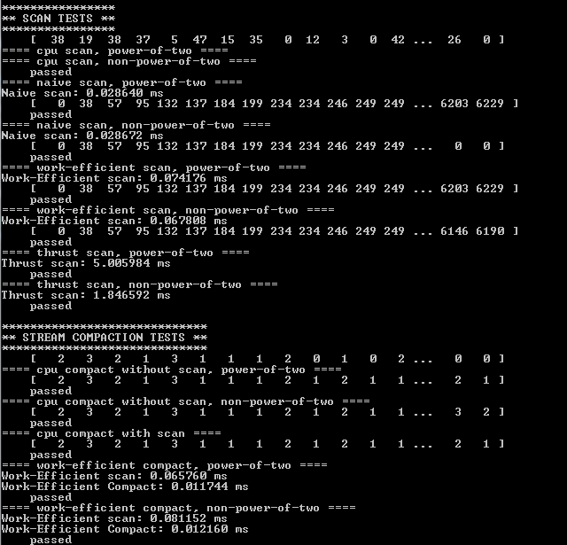

CUDA Stream Compaction
======================

**University of Pennsylvania, CIS 565: GPU Programming and Architecture, Project 2**

* David Liao
* Tested on: Windows 7 Professional, Intel(R) Xeon(R) CPU E5-1630 v4 @ 3.70 GHz 3.70 GHz, GTX 1070 8192MB (SIG Lab)
* Also Tested on: Windows 7 Professional, Intel(R) i7 4770 CPU @ 3.4GHz, Quadro K600 (SIG Lab)

### Analysis

#### Overall
All across the board, it appears that the CPU implementation lags behind all GPU implementations. The naive implementation trails behind the CPU implementation and the efficient GPU implementation beats the naive algorithm. Out of all 4 implementations, the Thrust implementation appears to be the fastest. It scales much better than the rest when given much larger arrays.

#### CPU
The cpu algorithm is a serialized sum iterated across the array. It is limited in computation by the fact that it is serial in nature.

#### Naive Implementation
The naive implementation is the initial parallelized scan that does not take into account the access-sensitive nature of its computation. Thus it suffers from mostly the fact that it has to deal with two memory buffers (to swap between). It does however beat the Work-Efficient algorithm on smaller data-sets. This might be due to the fact that less kernal invocations are called, thus less memory transfers between CPU and GPU occurs and more global memory accesses. 

#### Work-Efficient Implementation
This is an upgraded algorithm that allows in place computation without the extra memory buffer. This helps speed things up greatly. The initial implementation launched n threads for every iteration of the loop when the vast majority of them in the first few iterations will not be doing anything. This caused the Work-Efficient implementation to actually perform worse than the naive implementation. Instead, a smarter implementation would only launch as many threads as needed for that iteration. This is calculated using a bitshift counter to indicate the number of threads to launch in the kernel invocation. I could not get timing improvements for this as anything past 1 << 13 using the inefficient approach would crash the machine (Quadro K600) I was working on. But after I implemented the hack for launching the correct number of threads, everything ran smoothly.

#### Thrust
Thrust is the fastest implementation out of all 4. From NSight, it appears to used shared memory and is very efficient as compared to using global memory in our case which is very expensive. A quick search through thrust's git repo shows that they have multiple versions of scan that works on partitioned memory per warp or block. They also have an implementation working on global memory. Algorithm-wise, they appear to be using a similar up/down sweep algorithm. They also seem to use pick their block size very carefully based on empirical testing. Here's a [link](https://github.com/thrust/thrust/blob/2ef13096187b40a35a71451d09e49b14074b0859/thrust/system/cuda/detail/scan.inl) to their repo.

### Nsight Results
#### Thrust

#### Work Efficient Implementation

### Test Results

