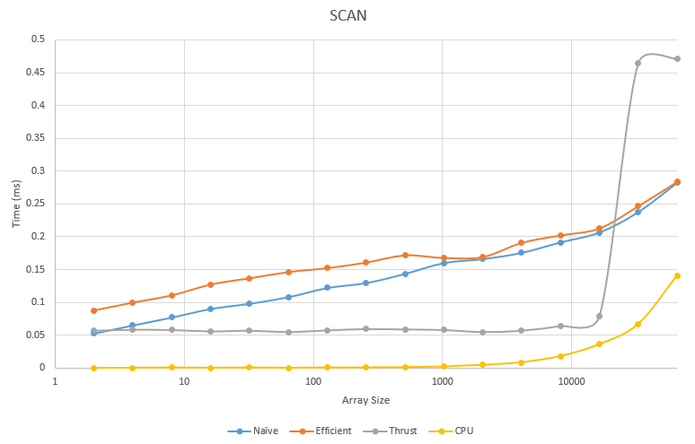
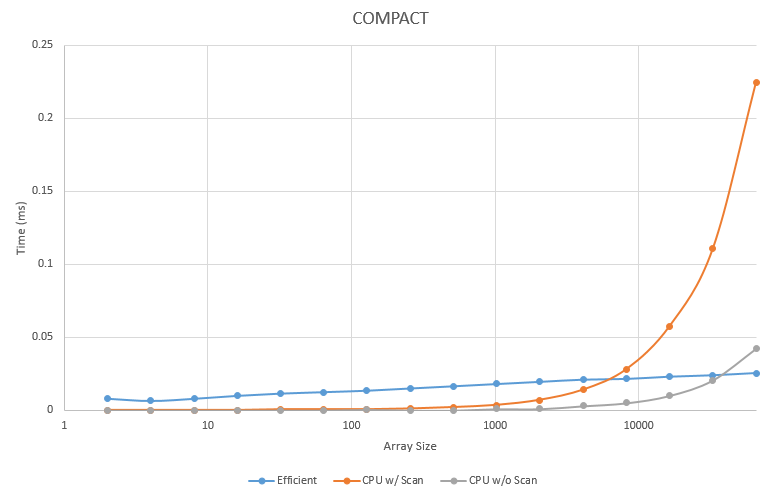
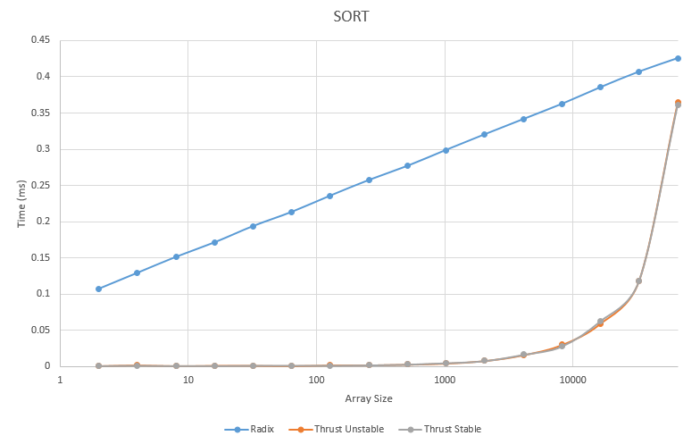
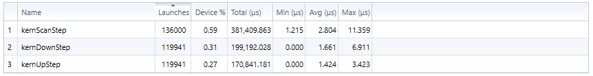

CUDA Stream Compaction
======================

**University of Pennsylvania, CIS 565: GPU Programming and Architecture, Project 2**

* Michael Willett
* Tested on: Windows 10, I5-4690k @ 3.50GHz 8.00GB, GTX 750-TI 2GB (Personal Computer)

## Contents
1. [Introduction](#intro)
2. [Algorithms](#part1)
3. [Verification and Performance Analysis](#part2)
4. [Development Process](#part3)
5. [Build Instructions](#appendix)


<a name="intro"/>
## Introduction: Parallel Algorithms
The goal of this project was to implement several versions of basic GPU algorithms to become familiar with
parallel programming ideas, as well as compare the performance overhead of memory management on GPU vs 
traditional CPU implementations.


<a name="part1"/>
## Section 1: Scanning, Stream Compaction, and Sorting
Three basic algorithms were implemented in this project

1. Scan - consective sum of all elements in the array prior to the current index.
2. Compaction - removal of all elements in an array that meet some boolean criteria.
3. Sort - arrange all elements in an array from low to high using a radix sort implementation.

Two implementations of GPU based scan were implemented: a naive version where elements were added in pairs until all
sums were computed, and a work efficient version where the total number of operators is reduced at the cost of performing
two separate stages of analysis. In the implemented version, the work-efficient scan performs slightly worse than
the naive approach from the extra down-sweep phase, however, there is room for improvement with smarter array
indexing to reduce the total number of GPU kernel calls. Both algorithms run in O(log(N)) which is theoretically
faster than CPU implementations at O(N), but performance analysis shows that this is only significant for large
arrays due to array access overhead on the GPU level.

Stream compaction shows similar trends in computation complexity in GPU vs. CPU performance, but catches up to CPU 
faster than the scan implementations since GPU accelerated reording of arrays is significantly faster than CPU 
implementations even for relatively small arrays.

The radix sort agorithm iterates over each bit in the input value from least significant to most significant, reordering
the array at each step. Again since the reording step is highly efficient on a GPU, the major overhead is due to
memory access time. 


<a name="part2"/>
## Section 2: Verification and Performance Analysis
*Code Correctness for Scan, Compact, and Sort Implementations:*

```
****************
** SCAN TESTS **
****************
    [  38  19  38  37   5  47  15  35   0  12   3   0  42 ...  35   0 ]
==== cpu scan, power-of-two ====
    [   0  38  57  95 132 137 184 199 234 234 246 249 249 ... 1604374 1604409 ]
==== cpu scan, non-power-of-two ====
    passed
==== naive scan, power-of-two ====
    [   0  38  57  95 132 137 184 199 234 234 246 249 249 ... 1604374 1604409 ]
    passed
==== naive scan, non-power-of-two ====
    passed
==== work-efficient scan, power-of-two ====
    [   0  38  57  95 132 137 184 199 234 234 246 249 249 ... 1604374 1604409 ]
    passed
==== work-efficient scan, non-power-of-two ====
    passed
==== thrust scan, power-of-two ====
    [   0  38  57  95 132 137 184 199 234 234 246 249 249 ... 1604374 1604409 ]
    passed
==== thrust scan, non-power-of-two ====
    passed

*****************************
** STREAM COMPACTION TESTS **
*****************************
    [   2   3   2   1   3   1   1   1   2   0   1   0   2 ...   1   0 ]
==== cpu compact without scan, power-of-two ====
    [   2   3   2   1   3   1   1   1   2   1   2   1   1 ...   1   1 ]
    passed
==== cpu compact without scan, non-power-of-two ====
    [   2   3   2   1   3   1   1   1   2   1   2   1   1 ...   3   3 ]
    passed
==== cpu compact with scan ====
    [   2   3   2   1   3   1   1   1   2   1   2   1   1 ...   1   1 ]
    passed
==== work-efficient compact, power-of-two ====
    passed
==== work-efficient compact, non-power-of-two ====
    passed

**********************
** RADIX SORT TESTS **
**********************
==== radix sort, power-of-two ====
    [  38 7719 21238 2437 8855 11797 8365 32285 ]
    [  38 2437 7719 8365 8855 11797 21238 32285 ]
    passed
==== radix sort, non-power-of-two ====
    [  38 7719 21238 2437 8855 11797 8365 ]
    [  38 2437 7719 8365 8855 11797 21238 ]
    passed

Sort passed 1000/1000 randomly generated verification tests.
```

### Benchmarks
*All performance measurements were averaged over 1000 samples on a single dataset*




We can quickly see from the above charts that run time for the various GPU implementations for scan, compact, and stort all 
have logarithmic growth, while CPU implementations observe polynomial growth (for scan and compaction, CPU growth is linear). 
As a result, for smaller arrays the overhead of memory access and array manipulation results in significantly worse execution 
time, and it isn't until arrays of about ~50,000 elements that performance is comparable. Unfortunately due to implementation
choices, the GPU implemenations crash for arrays larger than 2<sup>16</sup>, so performance analysis could not be run for these
large arrays, and estimates must be extrapolated from the current dataset.


The above figure shows the room for improvement of the efficient scan quite easily. Compared to the naive scan steps,
the up-sweep and down-sweep of the work-efficient implementation do not utilize nearly as much of the GPU per call as
the naive scan. Saturating the GPU here could yeild significant improvements by reducing the total number of kernal
calls required.


For the thrust library benchmarks, it is very interesting to see what appears to be standard linear growth due to the
performance loss in large arrays. Preliminary research on the thrust sort implementation implies that for basic sorting
of primitives like integers used in this example, it should also be using a radix sort implemented on the GPU. The charts
suggest, however, that thrust either not properly parallelizing the data, or it is running on the CPU. Documentation states
that method overloads that accept arrays located on the host will automatically handle data transfer to and from the GPU,
but that may not be the case. Additional work to instantiate the data on the GPU prior to the sort results in an Abort()
call from the thrust library, so additional investigation would be merited.

<a name="part3"/>
## Section 3: Development Process
Development was fairly straight forward algorithmic implementation. Future work could be done in the work effecient 
scan implementation to better handle launching kernal functions at the high depth levels when only a couple of sums are
being calculated for the whole array. This should improve peformance to be faster than the naive approach, but I
exepect it to still be outperformed by the thrust implementation as well as the CPU version for arrays with fewer than
30,000 elements.

It was worth noting there was a bug in using std::pow for calculating the array index in each kernal invocation. For some
unknown reason, it consisantly produced erronius values at 2<sup>11</sup>, or 2048. This is odd since variables were being cast to 
double precision before the computation, but the reverse cast was incorrect. This bug may be compiler specific as running
the index calculation on a separate machine result in accurate indexing in this range. Simply changing the code to use
bitshift operations cleared the error entirely. 


<a name="appendix"/>
## Appendix: Build Instructions
**CMakeLists.txt modified to include new sort class and update compute compatability**

* `src/` contains the source code.

**CMake note:** Do not change any build settings or add any files to your
project directly (in Visual Studio, Nsight, etc.) Instead, edit the
`src/CMakeLists.txt` file. Any files you add must be added here. If you edit it,
just rebuild your VS/Nsight project to make it update itself.

#### Windows

1. In Git Bash, navigate to your cloned project directory.
2. Create a `build` directory: `mkdir build`
   * (This "out-of-source" build makes it easy to delete the `build` directory
     and try again if something goes wrong with the configuration.)
3. Navigate into that directory: `cd build`
4. Open the CMake GUI to configure the project:
   * `cmake-gui ..` or `"C:\Program Files (x86)\cmake\bin\cmake-gui.exe" ..`
     * Don't forget the `..` part!
   * Make sure that the "Source" directory is like
     `.../Project2-Stream-Compaction`.
   * Click *Configure*.  Select your version of Visual Studio, Win64.
     (**NOTE:** you must use Win64, as we don't provide libraries for Win32.)
   * If you see an error like `CUDA_SDK_ROOT_DIR-NOTFOUND`,
     set `CUDA_SDK_ROOT_DIR` to your CUDA install path. This will be something
     like: `C:/Program Files/NVIDIA GPU Computing Toolkit/CUDA/v7.5`
   * Click *Generate*.
5. If generation was successful, there should now be a Visual Studio solution
   (`.sln`) file in the `build` directory that you just created. Open this.
   (from the command line: `explorer *.sln`)
6. Build. (Note that there are Debug and Release configuration options.)
7. Run. Make sure you run the `cis565_` target (not `ALL_BUILD`) by
   right-clicking it and selecting "Set as StartUp Project".
   * If you have switchable graphics (NVIDIA Optimus), you may need to force
     your program to run with only the NVIDIA card. In NVIDIA Control Panel,
     under "Manage 3D Settings," set "Multi-display/Mixed GPU acceleration"
     to "Single display performance mode".

#### OS X & Linux

It is recommended that you use Nsight.

1. Open Nsight. Set the workspace to the one *containing* your cloned repo.
2. *File->Import...->General->Existing Projects Into Workspace*.
   * Select the Project 0 repository as the *root directory*.
3. Select the *cis565-* project in the Project Explorer. From the *Project*
   menu, select *Build All*.
   * For later use, note that you can select various Debug and Release build
     configurations under *Project->Build Configurations->Set Active...*.
4. If you see an error like `CUDA_SDK_ROOT_DIR-NOTFOUND`:
   * In a terminal, navigate to the build directory, then run: `cmake-gui ..`
   * Set `CUDA_SDK_ROOT_DIR` to your CUDA install path.
     This will be something like: `/usr/local/cuda`
   * Click *Configure*, then *Generate*.
5. Right click and *Refresh* the project.
6. From the *Run* menu, *Run*. Select "Local C/C++ Application" and the
   `cis565_` binary.
