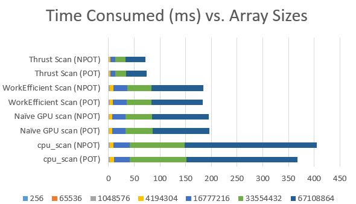
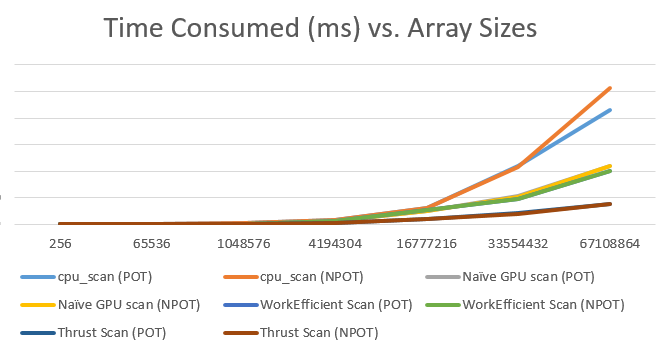
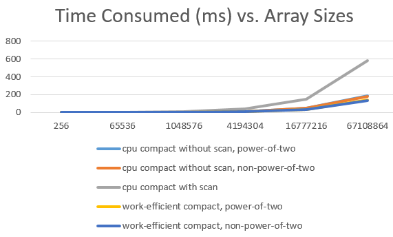
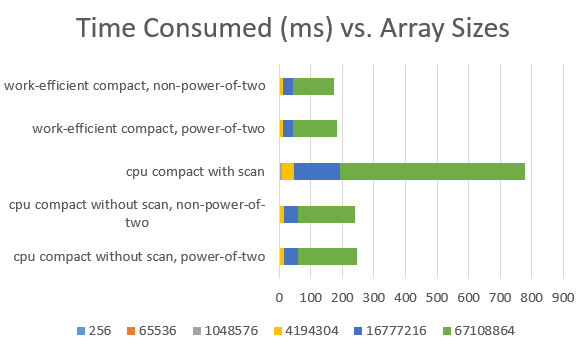
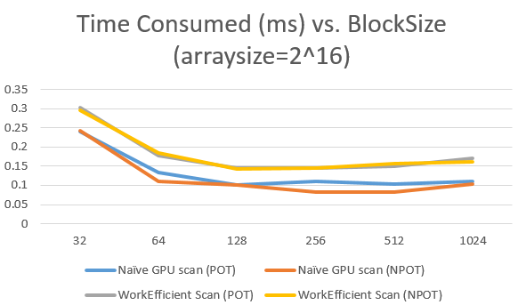
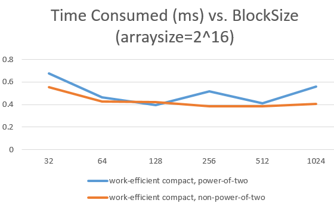

CUDA Stream Compaction
======================

**University of Pennsylvania, CIS 565: GPU Programming and Architecture, Project 2**

* Xiang Deng
* Tested on:  Windows 10-Home, i7-6700U @ 2.6GHz 16GB, GTX 1060 6GB (Personal Computer)

 
* Compare all of these GPU Scan implementations (Naive, Work-Efficient, and Thrust) to the serial CPU version of Scan. Plot a graph of the comparison (with array size on the independent axis).

Based on the figure and data above, regarding scanning, I found the bottleneck for GPU outperforms the GPU is around the arraysize of 2^16, after which the GPU sigificantly speed up than the CPU.
The CPU shows its adavantage for small arraysize.

Based on the figure and data above, regarding compacting, I found the bottleneck for GPU outperforms the GPU is between the arraysize of 2^16 and 2^20, after which the GPU sigificantly speed up than the CPU.
The CPU still shows its adavantage for small arraysize.

* Optimization of blocksize:
Experiments was conducted on various blocksizes from 32 to 1024 with exponential growth. Typically we observed the optimizal value of block size (256) which best 
balance the optimal value of scan time as well as compact time for GPU. Since earlier we observed the array size of 2^16 is around the point of "bottleneck", we 
used this parameter for the tuning of the blocksize.

