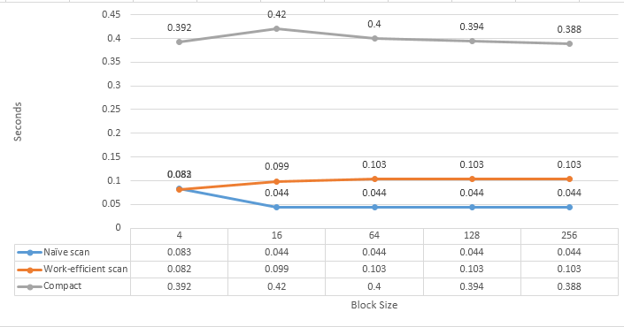

CUDA Stream Compaction
======================

**University of Pennsylvania, CIS 565: GPU Programming and Architecture, Project 2**

* Ottavio Hartman
* Tested on: Windows 7, i7-4790 @ 3.60GHz 16GB, Quadro K420 (Moore 102 Lab)

### Summary
This project contains the implementation and tests for a __CPU Scan, CPU stream compaction, naive GPU scan, work-efficient GPU scan, and GPU stream compaction.__

### Performance analysis

