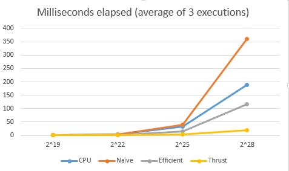
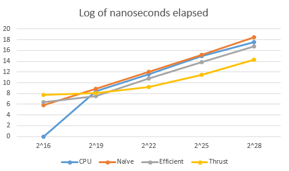

CUDA Stream Compaction
======================

**University of Pennsylvania, CIS 565: GPU Programming and Architecture, Project 2**

* Name: Zhan Xiong Chin
* Tested on: Windows 7 Professional, Intel(R) Xeon(R) CPU E5-1630 v4 @ 3.70 GHz 3.70 GHz, GTX 1070 8192MB (SIG Lab)

Overview
========
This implements a GPU-based scan (i.e. computes the prefix sums of an array) and stream compaction (i.e. 
moves nonzero elements to the front of array). There are versions for a CPU-based scan, a naive GPU-based scan 
(uses O(nlogn) additions) and a work-efficient GPU-based scan (uses O(n) additions).

Build Instructions
==================
[See here](https://github.com/CIS565-Fall-2016/Project0-CUDA-Getting-Started/blob/master/INSTRUCTION.md)

Performance analysis
====================
Milliseconds to calculate prefix sums for arrays of given sizes:



Log2 of nanoseconds for same data:



The timings above did not include the time needed to copy arrays onto device. 

For small arrays, the naive algorithm appears to be the fastest, though this may be due to the inability to
effectively time CPU execution for times smaller than 1 millisecond. The CPU algorithm still beats out the
naive algorithm for most of the timings, suggesting that the extra logn additions needed is slowing down the execution
of the naive algorithm significantly.

The efficient algorithm is approximately 3 times faster than the naive algorithm and twice as fast as the CPU algorithm.
This is in line with the O(n) operations needed by both of them; the GPU algorithm is making better use of its 
multiple cores to achieve this speedup.

Compared to the thrust-based implementation, all algorithms beat it for small arrays, but it is significantly faster
than all other algorithms for large arrays. Based on the large number of registers used and the small grid size, it
may be using the work-efficient algorithm, but with a larger base than 2 (e.g. ternary or quarternary tree). 

Test output
===========
```
S:\cis565\Project2-Stream-Compaction\build>Release\cis565_stream_compaction_test
.exe

****************
** SCAN TESTS **
****************
    [  38  19  38  37   5  47  15  35   0  12   3   0  42 ...  10   0 ]
==== cpu scan, power-of-two ====
    [   0  38  57  95 132 137 184 199 234 234 246 249 249 ... 205473618 20547362
8 ]
==== cpu scan, non-power-of-two ====
    [   0  38  57  95 132 137 184 199 234 234 246 249 249 ... 205473252 20547325
5 ]
    passed
==== naive scan, power-of-two ====
    [   0  38  57  95 132 137 184 199 234 234 246 249 249 ... 205473618 20547362
8 ]
    passed
==== naive scan, non-power-of-two ====
    passed
==== work-efficient scan, power-of-two ====
    passed
==== work-efficient scan, non-power-of-two ====
    passed
==== thrust scan, power-of-two ====
    passed
==== thrust scan, non-power-of-two ====
    passed

*****************************
** STREAM COMPACTION TESTS **
*****************************
    [   2   3   2   1   3   1   1   1   2   0   1   0   2 ...   0   0 ]
==== cpu compact without scan, power-of-two ====
    [   2   3   2   1   3   1   1   1   2   1   2   1   1 ...   2   2 ]
    passed
==== cpu compact without scan, non-power-of-two ====
    [   2   3   2   1   3   1   1   1   2   1   2   1   1 ...   1   3 ]
    passed
==== cpu compact with scan ====
    [   2   3   2   1   3   1   1   1   2   1   2   1   1 ...   2   2 ]
    passed
==== work-efficient compact, power-of-two ====
    passed
==== work-efficient compact, non-power-of-two ====
    passed

S:\cis565\Project2-Stream-Compaction\build>
```