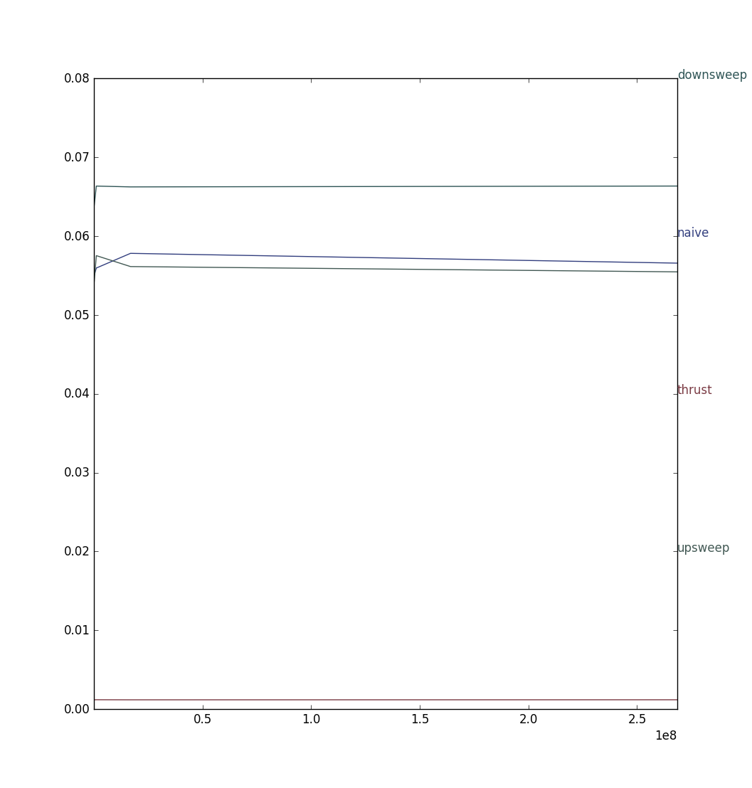

CUDA Stream Compaction
======================

**University of Pennsylvania, CIS 565: GPU Programming and Architecture, Project 2**

* (TODO) Rony Edde (redde)
* Tested on: Windows 10, i7-6700k @ 4.00GHz 64GB, GTX 980M 8GB (Personal Laptop)

### (TODO: Your README)

Include analysis, etc. (Remember, this is public, so don't put
anything here that you don't want to share with the world.)


This is an implementation of scan and reduce on the CPU and GPU
for stream compaction.
There are 2 types of arrays to consider.  Powers of 2 and non
powers of 2 which are part of the test.

* Scan
  * The first method used is on the CPU where all elements are
  added using a for loop.  This works very well on small arrays.

  * The second method consists of using the GPU to compute the
  scan result.  This is a naive implementation where the first
  iteration copies elements left to right (exclusive), then 
  2^(i+1) for a depth of log2(n).  Each depth skips 2^(d-1).
  This is faster than the CPU version for large arrays.

  * The third method uses a double sweep.  An upsweep, followed by
  a downsweep using a balanced tree form.  Each sweeps takes 
  log2(n-1) iterations but the calls on the GPU are only taking
  place on multiples of 2^(d+1).  This should be fast because
  there are only O(n) adds for the up sweep and O(n) adds and
  O(n) swaps.

  * Thrust scan uses CUDA's thrust exclusive function which is 
  built in the CUDA library.

* Stream Compaction
  * The first implementation is on the CPU where a for loop looks
  for values greater than 0 and adds them to the new array while
  incrementing the count when a non zero value is found.

  * The second implementation uses the CPU but also uses the scan
  function to look up indices.

  * The third implementation uses the GPU to generate a [0 1] 
  mapped array which is then run into the scan GPU function
  and used as an index lookup for placing the elements.
  After the scan function all non zero elements will be 
  present wich will result in a compact array with no zeros.


* Thrust 
  * The implementation is mentionned in the Scan section.

* Radix sort
  * There are 2 versions of the Radix sort.  This first one runs
  on the CPU using a CPU version on scan.

  * The second version uses the GPU to run the scan.  It also uses
  a GPU function to determine the max number in the array.  This
  is used to determine how many loops are needed before we reach
  the maximum amount of decimals in the maximum number.
  Another GPU function is used to shift the scan from exclusive
  to inclusive which is needed for a correct radix sort.
  There are multiple scan functions that can be used, a few are
  benchmarked.

* Benchmarks
  * Running benhmarks on a range of 256 to 65536 with a power of 4
  increment gave the following results:


```
****************
** SCAN TESTS **
****************
    [  38  19  38  37   5  47  15  35   0  12   3   0  42 ...  26   0 ]
==== cpu scan, power-of-two ====
    [   0  38  57  95 132 137 184 199 234 234 246 249 249 ... 6203 6229 ]
==== cpu scan, non-power-of-two ====
    [   0  38  57  95 132 137 184 199 234 234 246 249 249 ... 6146 6190 ]
    passed
==== naive scan, power-of-two ====
    [   0  38  57  95 132 137 184 199 234 234 246 249 249 ... 6203 6229 ]
    passed
==== naive scan, non-power-of-two ====
    [   0  38  57  95 132 137 184 199 234 234 246 249 249 ...   0   0 ]
    passed
==== work-efficient scan, power-of-two ====
    passed
==== work-efficient scan, non-power-of-two ====
    passed
==== thrust scan, power-of-two ====
    passed
==== thrust scan, non-power-of-two ====
    passed
==== cpu radix sort ====
    [   0   0   0   0   0   0   1   1   1   1   2   2   2 ...  49  49 ]
    passed
==== gpu radix sort cpu scan ====
    [   0   0   0   0   0   0   1   1   1   1   2   2   2 ...  49  49 ]
    passed
==== gpu radix sort naive scan ====
    [   0   0   0   0   0   0   1   1   1   1   2   2   2 ...  49  49 ]
    passed
==== gpu radix sort thrust scan ====
    [   0   0   0   0   0   0   1   1   1   1   2   2   2 ...  49  49 ]
    passed

*****************************
** STREAM COMPACTION TESTS **
*****************************
    [   2   3   2   1   3   1   1   1   2   0   1   0   2 ...   0   0 ]
==== cpu compact without scan, power-of-two ====
    [   2   3   2   1   3   1   1   1   2   1   2   1   1 ...   2   1 ]
    passed
==== cpu compact without scan, non-power-of-two ====
    [   2   3   2   1   3   1   1   1   2   1   2   1   1 ...   3   2 ]
    passed
==== cpu compact with scan ====
    [   2   3   2   1   3   1   1   1   2   1   2   1   1 ...   2   1 ]
    passed
==== work-efficient compact, power-of-two ====
    passed
==== work-efficient compact, non-power-of-two ====
    passed


==== BENCHMARK on 256 items ====
naive scan time: 0.054762
upsweep time: 0.053930
downsweep time: 0.066717
thurst time: 0.001216

==== BENCHMARK on 4096 items ====
naive scan time: 0.055395
upsweep time: 0.056800
downsweep time: 0.063933
thurst time: 0.001216

==== BENCHMARK on 65536 items ====
naive scan time: 0.055034
upsweep time: 0.054170
downsweep time: 0.063862
thurst time: 0.001190

==== BENCHMARK on 1048576 items ====
naive scan time: 0.055942
upsweep time: 0.057514
downsweep time: 0.066336
thurst time: 0.001194

==== BENCHMARK on 16777216 items ====
naive scan time: 0.057802
upsweep time: 0.056128
downsweep time: 0.066230
thurst time: 0.001184

==== BENCHMARK on 268435456 items ====
naive scan time: 0.056563
upsweep time: 0.055456
downsweep time: 0.066339
thurst time: 0.001190

-------- GPU calls results --------
naive:  0.054762 0.055395 0.055034 0.055942 0.057802 0.056563
upsweep:  0.053930 0.056800 0.054170 0.057514 0.056128 0.055456
downsweep:  0.066717 0.063933 0.063862 0.066336 0.066230 0.066339
thrust:  0.001216 0.001216 0.001190 0.001194 0.001184 0.001190

****************
** BENCHMARKS **
****************

** SIZE = 256 **
****************
    [  38  19  38  37   5  47  15  35   0  12   3   0  42 ...  26   0 ]
==== cpu scan, power-of-two ====
Time:  0 microSeconds
==== naive scan, power-of-two ====
Time:  1204 microSeconds
==== work-efficient scan, power-of-two ====
Time:  747 microSeconds
==== thrust scan, power-of-two ====
Time:  58 microSeconds
==== cpu radix sort ====
Time:  89 microSeconds
==== gpu radix sort cpu scan ====
Time:  1209 microSeconds
==== gpu radix sort naive scan ====
Time:  1356 microSeconds
==== gpu radix sort thrust scan ====
Time:  1080 microSeconds
==== cpu compact without scan, power-of-two ====
Time:  0 microSeconds
==== cpu compact with scan ====
Time:  2 microSeconds
==== work-efficient compact, power-of-two ====
Time:  1020 microSeconds

** SIZE = 512 **
****************
    [  38  19  38  37   5  47  15  35   0  12   3   0  42 ...  11   0 ]
==== cpu scan, power-of-two ====
Time:  1 microSeconds
==== naive scan, power-of-two ====
Time:  563 microSeconds
==== work-efficient scan, power-of-two ====
Time:  657 microSeconds
==== thrust scan, power-of-two ====
Time:  91 microSeconds
==== cpu radix sort ====
Time:  142 microSeconds
==== gpu radix sort cpu scan ====
Time:  2253 microSeconds
==== gpu radix sort naive scan ====
Time:  2997 microSeconds
==== gpu radix sort thrust scan ====
Time:  2042 microSeconds
==== cpu compact without scan, power-of-two ====
Time:  1 microSeconds
==== cpu compact with scan ====
Time:  7 microSeconds
==== work-efficient compact, power-of-two ====
Time:  862 microSeconds

** SIZE = 1024 **
****************
    [  38  19  38  37   5  47  15  35   0  12   3   0  42 ...  40   0 ]
==== cpu scan, power-of-two ====
Time:  2 microSeconds
==== naive scan, power-of-two ====
Time:  595 microSeconds
==== work-efficient scan, power-of-two ====
Time:  674 microSeconds
==== thrust scan, power-of-two ====
Time:  178 microSeconds
==== cpu radix sort ====
Time:  282 microSeconds
==== gpu radix sort cpu scan ====
Time:  2152 microSeconds
==== gpu radix sort naive scan ====
Time:  3216 microSeconds
==== gpu radix sort thrust scan ====
Time:  2087 microSeconds
==== cpu compact without scan, power-of-two ====
Time:  3 microSeconds
==== cpu compact with scan ====
Time:  9 microSeconds
==== work-efficient compact, power-of-two ====
Time:  829 microSeconds

** SIZE = 2048 **
****************
    [  38  19  38  37   5  47  15  35   0  12   3   0  42 ...  32   0 ]
==== cpu scan, power-of-two ====
Time:  4 microSeconds
==== naive scan, power-of-two ====
Time:  546 microSeconds
==== work-efficient scan, power-of-two ====
Time:  766 microSeconds
==== thrust scan, power-of-two ====
Time:  371 microSeconds
==== cpu radix sort ====
Time:  568 microSeconds
==== gpu radix sort cpu scan ====
Time:  2536 microSeconds
==== gpu radix sort naive scan ====
Time:  3176 microSeconds
==== gpu radix sort thrust scan ====
Time:  2185 microSeconds
==== cpu compact without scan, power-of-two ====
Time:  6 microSeconds
==== cpu compact with scan ====
Time:  19 microSeconds
==== work-efficient compact, power-of-two ====
Time:  853 microSeconds

** SIZE = 4096 **
****************
    [  38  19  38  37   5  47  15  35   0  12   3   0  42 ...  24   0 ]
==== cpu scan, power-of-two ====
Time:  8 microSeconds
==== naive scan, power-of-two ====
Time:  615 microSeconds
==== work-efficient scan, power-of-two ====
Time:  786 microSeconds
==== thrust scan, power-of-two ====
Time:  704 microSeconds
==== cpu radix sort ====
Time:  1135 microSeconds
==== gpu radix sort cpu scan ====
Time:  2460 microSeconds
==== gpu radix sort naive scan ====
Time:  3368 microSeconds
==== gpu radix sort thrust scan ====
Time:  2429 microSeconds
==== cpu compact without scan, power-of-two ====
Time:  14 microSeconds
==== cpu compact with scan ====
Time:  40 microSeconds
==== work-efficient compact, power-of-two ====
Time:  983 microSeconds

** SIZE = 8192 **
****************
    [  38  19  38  37   5  47  15  35   0  12   3   0  42 ...   4   0 ]
==== cpu scan, power-of-two ====
Time:  18 microSeconds
==== naive scan, power-of-two ====
Time:  629 microSeconds
==== work-efficient scan, power-of-two ====
Time:  784 microSeconds
==== thrust scan, power-of-two ====
Time:  1444 microSeconds
==== cpu radix sort ====
Time:  2306 microSeconds
==== gpu radix sort cpu scan ====
Time:  3193 microSeconds
==== gpu radix sort naive scan ====
Time:  3786 microSeconds
==== gpu radix sort thrust scan ====
Time:  2776 microSeconds
==== cpu compact without scan, power-of-two ====
Time:  30 microSeconds
==== cpu compact with scan ====
Time:  81 microSeconds
==== work-efficient compact, power-of-two ====
Time:  1021 microSeconds

** SIZE = 16384 **
****************
    [  38  19  38  37   5  47  15  35   0  12   3   0  42 ...  26   0 ]
==== cpu scan, power-of-two ====
Time:  32 microSeconds
==== naive scan, power-of-two ====
Time:  653 microSeconds
==== work-efficient scan, power-of-two ====
Time:  1079 microSeconds
==== thrust scan, power-of-two ====
Time:  2876 microSeconds
==== cpu radix sort ====
Time:  4595 microSeconds
==== gpu radix sort cpu scan ====
Time:  4210 microSeconds
==== gpu radix sort naive scan ====
Time:  4916 microSeconds
==== gpu radix sort thrust scan ====
Time:  3774 microSeconds
==== cpu compact without scan, power-of-two ====
Time:  63 microSeconds
==== cpu compact with scan ====
Time:  165 microSeconds
==== work-efficient compact, power-of-two ====
Time:  1257 microSeconds

** SIZE = 32768 **
****************
    [  38  19  38  37   5  47  15  35   0  12   3   0  42 ...   7   0 ]
==== cpu scan, power-of-two ====
Time:  65 microSeconds
==== naive scan, power-of-two ====
Time:  808 microSeconds
==== work-efficient scan, power-of-two ====
Time:  1274 microSeconds
==== thrust scan, power-of-two ====
Time:  5643 microSeconds
==== cpu radix sort ====
Time:  8982 microSeconds
==== gpu radix sort cpu scan ====
Time:  6846 microSeconds
==== gpu radix sort naive scan ====
Time:  7885 microSeconds
==== gpu radix sort thrust scan ====
Time:  6811 microSeconds
==== cpu compact without scan, power-of-two ====
Time:  128 microSeconds
==== cpu compact with scan ====
Time:  335 microSeconds
==== work-efficient compact, power-of-two ====
Time:  1705 microSeconds

** SIZE = 65536 **
****************
    [  38  19  38  37   5  47  15  35   0  12   3   0  42 ...  35   0 ]
==== cpu scan, power-of-two ====
Time:  131 microSeconds
==== naive scan, power-of-two ====
Time:  1140 microSeconds
==== work-efficient scan, power-of-two ====
Time:  1760 microSeconds
==== thrust scan, power-of-two ====
Time:  11324 microSeconds
==== cpu radix sort ====
Time:  18094 microSeconds
==== gpu radix sort cpu scan ====
Time:  11267 microSeconds
==== gpu radix sort naive scan ====
Time:  11923 microSeconds
==== gpu radix sort thrust scan ====
Time:  10084 microSeconds
==== cpu compact without scan, power-of-two ====
Time:  260 microSeconds
==== cpu compact with scan ====
Time:  672 microSeconds
==== work-efficient compact, power-of-two ====
Time:  2814 microSeconds

** SIZE = 131072 **
****************
    [  38  19  38  37   5  47  15  35   0  12   3   0  42 ...  10   0 ]
==== cpu scan, power-of-two ====
Time:  263 microSeconds
==== naive scan, power-of-two ====
Time:  1650 microSeconds
==== work-efficient scan, power-of-two ====
Time:  3079 microSeconds
==== thrust scan, power-of-two ====
Time:  22802 microSeconds
==== cpu radix sort ====
Time:  36258 microSeconds
==== gpu radix sort cpu scan ====
Time:  19548 microSeconds
==== gpu radix sort naive scan ====
Time:  19723 microSeconds
==== gpu radix sort thrust scan ====
Time:  18615 microSeconds
==== cpu compact without scan, power-of-two ====
Time:  517 microSeconds
==== cpu compact with scan ====
Time:  1571 microSeconds
==== work-efficient compact, power-of-two ====
Time:  1465 microSeconds

** SIZE = 262144 **
****************
    [  38  19  38  37   5  47  15  35   0  12   3   0  42 ...  42   0 ]
==== cpu scan, power-of-two ====
Time:  569 microSeconds
==== naive scan, power-of-two ====
Time:  17 microSeconds
==== work-efficient scan, power-of-two ====
Time:  25 microSeconds
==== thrust scan, power-of-two ====
Time:  45705 microSeconds
==== cpu radix sort ====
Time:  73556 microSeconds
==== gpu radix sort cpu scan ====
Time:  5243 microSeconds
==== gpu radix sort naive scan ====
Time:  5223 microSeconds
==== gpu radix sort thrust scan ====
Time:  5214 microSeconds
==== cpu compact without scan, power-of-two ====
Time:  1056 microSeconds
==== cpu compact with scan ====
Time:  3225 microSeconds
==== work-efficient compact, power-of-two ====
Time:  612 microSeconds

** SIZE = 524288 **
****************
    [  38  19  38  37   5  47  15  35   0  12   3   0  42 ...  42   0 ]
==== cpu scan, power-of-two ====
Time:  1139 microSeconds
==== naive scan, power-of-two ====
Time:  18 microSeconds
==== work-efficient scan, power-of-two ====
Time:  26 microSeconds
==== thrust scan, power-of-two ====
Time:  92465 microSeconds
==== cpu radix sort ====
Time:  144470 microSeconds
==== gpu radix sort cpu scan ====
Time:  10536 microSeconds
==== gpu radix sort naive scan ====
Time:  10634 microSeconds
==== gpu radix sort thrust scan ====
Time:  10634 microSeconds
==== cpu compact without scan, power-of-two ====
Time:  2098 microSeconds
==== cpu compact with scan ====
Time:  6596 microSeconds
==== work-efficient compact, power-of-two ====
Time:  1197 microSeconds

** SIZE = 1048576 **
****************
    [  38  19  38  37   5  47  15  35   0  12   3   0  42 ...   6   0 ]
==== cpu scan, power-of-two ====
Time:  2288 microSeconds
==== naive scan, power-of-two ====
Time:  19 microSeconds
==== work-efficient scan, power-of-two ====
Time:  27 microSeconds
==== thrust scan, power-of-two ====
Time:  185075 microSeconds
==== cpu radix sort ====
Time:  289369 microSeconds
==== gpu radix sort cpu scan ====
Time:  22012 microSeconds
==== gpu radix sort naive scan ====
Time:  21773 microSeconds
==== gpu radix sort thrust scan ====
Time:  21896 microSeconds
==== cpu compact without scan, power-of-two ====
Time:  4228 microSeconds
==== cpu compact with scan ====
Time:  13323 microSeconds
==== work-efficient compact, power-of-two ====
Time:  2729 microSeconds

** SIZE = 2097152 **
****************
    [  38  19  38  37   5  47  15  35   0  12   3   0  42 ...   2   0 ]
==== cpu scan, power-of-two ====
Time:  4616 microSeconds
==== naive scan, power-of-two ====
Time:  20 microSeconds
==== work-efficient scan, power-of-two ====
Time:  29 microSeconds
==== thrust scan, power-of-two ====
Time:  369500 microSeconds
==== cpu radix sort ====
Time:  587131 microSeconds
==== gpu radix sort cpu scan ====
Time:  44624 microSeconds
==== gpu radix sort naive scan ====
Time:  44796 microSeconds
==== gpu radix sort thrust scan ====
Time:  44965 microSeconds
==== cpu compact without scan, power-of-two ====
Time:  8423 microSeconds
==== cpu compact with scan ====
Time:  27154 microSeconds
==== work-efficient compact, power-of-two ====
Time:  6133 microSeconds

** SIZE = 4194304 **
****************
    [  38  19  38  37   5  47  15  35   0  12   3   0  42 ...  26   0 ]
==== cpu scan, power-of-two ====
Time:  9468 microSeconds
==== naive scan, power-of-two ====
Time:  20 microSeconds
==== work-efficient scan, power-of-two ====
Time:  33 microSeconds
==== thrust scan, power-of-two ====
Time:  736214 microSeconds
==== cpu radix sort ====
Time:  1182810 microSeconds
==== gpu radix sort cpu scan ====
Time:  90747 microSeconds
==== gpu radix sort naive scan ====
Time:  89688 microSeconds
==== gpu radix sort thrust scan ====
Time:  90998 microSeconds
==== cpu compact without scan, power-of-two ====
Time:  17085 microSeconds
==== cpu compact with scan ====
Time:  54581 microSeconds
==== work-efficient compact, power-of-two ====
Time:  12071 microSeconds

** SIZE = 8388608 **
****************
    [  38  19  38  37   5  47  15  35   0  12   3   0  42 ...  10   0 ]
==== cpu scan, power-of-two ====
Time:  18279 microSeconds
==== naive scan, power-of-two ====
Time:  24 microSeconds
==== work-efficient scan, power-of-two ====
Time:  35 microSeconds
==== thrust scan, power-of-two ====
Time:  1473584 microSeconds
==== cpu radix sort ====
Time:  2342165 microSeconds
==== gpu radix sort cpu scan ====
Time:  181044 microSeconds
==== gpu radix sort naive scan ====
Time:  182013 microSeconds
==== gpu radix sort thrust scan ====
Time:  181109 microSeconds
==== cpu compact without scan, power-of-two ====
Time:  34329 microSeconds
==== cpu compact with scan ====
Time:  109976 microSeconds
==== work-efficient compact, power-of-two ====
Time:  23858 microSeconds

** SIZE = 16777216 **
****************
    [  38  19  38  37   5  47  15  35   0  12   3   0  42 ...  42   0 ]
==== cpu scan, power-of-two ====
Time:  37124 microSeconds
==== naive scan, power-of-two ====
Time:  23 microSeconds
==== work-efficient scan, power-of-two ====
Time:  35 microSeconds
==== thrust scan, power-of-two ====
Time:  2988794 microSeconds
==== cpu radix sort ====
Time:  4724527 microSeconds
==== gpu radix sort cpu scan ====
Time:  374356 microSeconds
==== gpu radix sort naive scan ====
Time:  367443 microSeconds
==== gpu radix sort thrust scan ====
Time:  359604 microSeconds
==== cpu compact without scan, power-of-two ====
Time:  68579 microSeconds
==== cpu compact with scan ====
Time:  218190 microSeconds
==== work-efficient compact, power-of-two ====
Time:  49360 microSeconds
Press any key to continue . . .
```

* Large scale results (in microseconds):


* Small scale results (in microseconds):


The significance is obvious between the CPU and GPU
implementations.  When looking at small arrays, the
CPU seems to take an interesting advantage.  However
on large arrays, the CPU implementations scale very
poorly, hence the need to have 2 graph scales.
Radix sort suffers particularly when running on the 
CPU.  One pattern that emerges is that the naive
and efficient methods scale logarithmically.
The efficient version was a fraction slower and that
is due to interrupts between the up and downscan.
Every time upscan is called, memory has to be
allocated and copied, the same happens with downscan
This is shown in the last figure.  Despite that,
the loss is minimal.
Thrust scan does well and scales linearly albeit not
as good as the naive and efficient methods.
One thing that was interesting to note is that radix
benefitted more from the thrust scan than the other
GPU implementations.  Again possibly due to the 
multiple GPU functions and memory copies.
The get max number function is run on the GPU and 
memory is copied back and forth.
THe biggest bottleneck in all the test was in the 
memory copying especially between the host and
the device.  The GPU functions runs extremely fast
in comparison to the memory copying.
The following benchmarks took a few minutes to run
while you'll notice that the GPU time per function
is close to negligeable.  Time is is milliseconds:
* GPU functions timing (in milliseconds)


One bottleneck that manifests itself in the graph
below is from the kernDecimalsMap function.
Not enough resources are used during this function
which created a bottleneck that is minimal but not
desired.  About 40% og the GPU is not used.
This is very obvious when looking at the following
timeline and the kernDecimalsMap function:
* Cuda memory calls frequency:


* DecimalsMap bottleneck:


