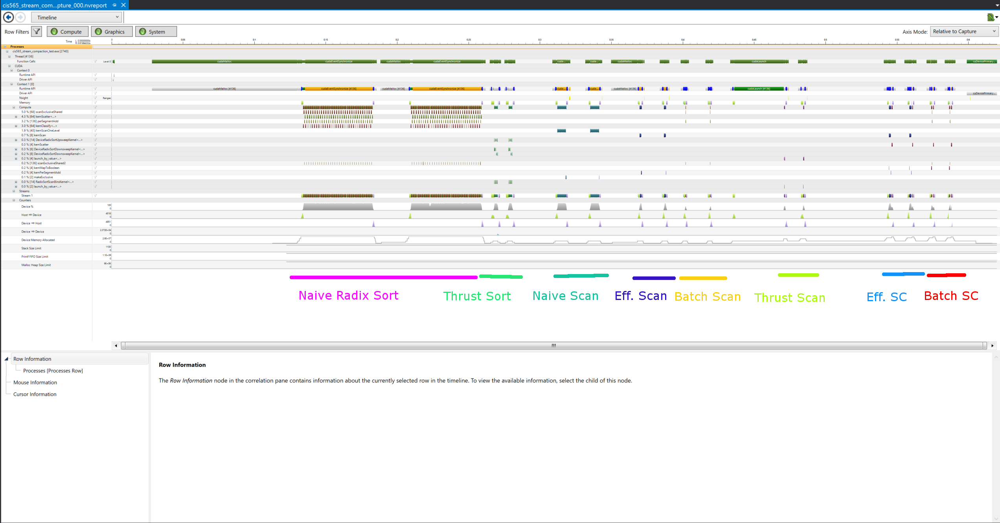
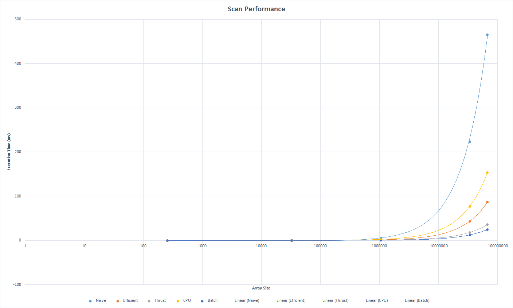
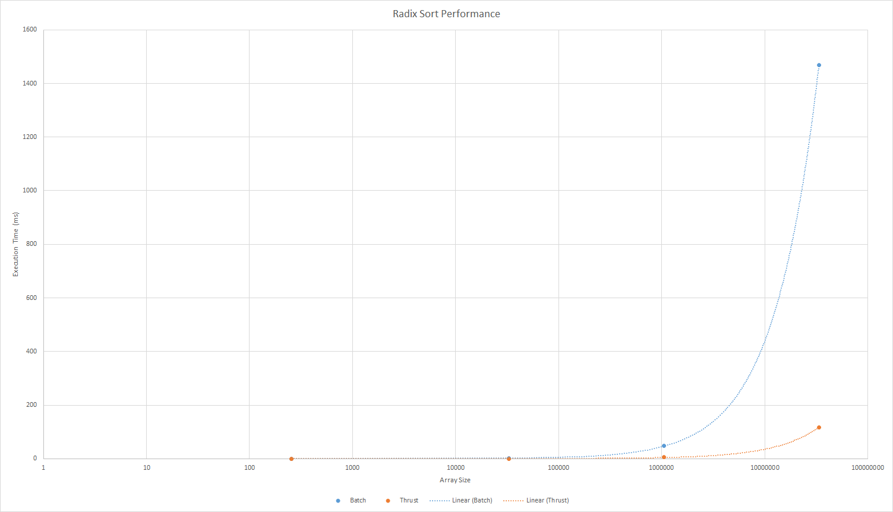

CUDA Stream Compaction
======================

**University of Pennsylvania, CIS 565: GPU Programming and Architecture, Project 2**

* Jian Ru
* Tested on: Windows 10, i7-4850 @ 2.30GHz 16GB, GT 750M 2GB (Personal)

### List of Features

* Batch scan (faster than thrust implementation even when data size is as large as 2^26)
* CPU scan and stream compaction
* Naive GPU scan
* Work-efficient GPU scan and stream compaction (used shared memory)
* Thrust scan
* GPU radix sort (added radix_sort.h and radix_sort.cu)
* Custom tests

### Performance Analysis

  

* Optimizing Block Sizes
  * 128 or 256 turn out to be the best. Unless you use non-multiple of warp size,
  really small (like 32), or really big (like 1024) block size, the performance difference
  is not really that huge
  * The only exception is work-efficient scan. Since reducing block size increases the number
  of sub-sums and likely increases the number of recursions, it enjoys a larger block size
  (512 turns out to be optimal on my machine). Even if so, using 1024 turns out to be slower.
  It may due to reduced concurrent execution, since all the threads in a block need to be
  synchtronized at 3 different places in the kernel. Increasing block size means fewer threads
  can terminate and leave multiprocessor early. So it is likely to hurt performance.

* Array Size vs. Execution Time (ms)
  * Exclusive scan
  
  

  | Array Size | Naive  | Efficient | Thrust | CPU    | Batch |
  | ---------- | -----  | --------- | ------ | ---    | ----- |
  | 2^8        | 0.03   | 0.01      | 0.02   | 0.00   | 0.01  |
  | 2^15       | 0.42   | 0.07      | 0.70   | 0.08   | 0.03  |
  | 2^20       | 5.72   | 1.39      | 0.93   | 2.31   | 0.42  |
  | 2^25       | 223.64 | 43.40     | 18.15  | 77.18  | 12.39 |
  | 2^26       | 465.44 | 86.81     | 35.85  | 153.48 | 24.75 |

  * Stream compaction
  
  

  | Array Size | Efficient | CPU (no scan) | CPU (with scan) | Batch |
  | ---        | ---       | ---           | ---             | ---   |
  | 2^8        | 0.09      | 0.00          | 0.00            | 0.11  |
  | 2^15       | 0.16      | 0.09          | 0.20            | 0.15  |
  | 2^20       | 3.78      | 2.70          | 6.03            | 1.61  |
  | 2^25       | 72.91     | 85.98         | 196.08          | 42.37 |
  | 2^26       | 143.49    | 174.08        | 391.90          | 81.53 |
  
  * Radix sort
  
  

  | Array Size | Batch | Thrust |
  | ---        | ---       | --- |
  | 2^8  | 0.42 | 0.58 |
  | 2^15 | 2.44 | 0.34 |
  | 2^20 | 47.35 | 5.80 |
  | 2^25 | 1468.98 | 116.92 |

* Performance Bottlenecks
  * CUDA runtime APIs for memory manipulation (e.g. cudaMalloc, cudaMemcpy, cudaFree) are super expensive
  * Naive scan
    * Excessive global memory access
	* Too many kernel calls (each level of up/down-sweep require one kernel call)
  * Work-efficient scan
    * Too many threads and in efficient memory I/O
      * Threads exceed the number of cores on GPU will queue up. Too many threads also increases
      management and scheduling overhead
      * Each thread only read in two 4-byte data and the two 4-byte are read in using two separate
      instructions. GPU, due to its SIMD nature, is better in handling vector I/O. That is why
      batch scan loads and stores a vec4 in each thread
    * Too many kernel calls when array size is large
	* In my implementation, if array size exceed 2 times block size, two more calls are
	required: one scan the sub-sums and another one scatter scanned sub-sums to corresponding
	blocks. If the size of sub-sum array is further greater than 2 times block size, another
	two extra calls are generated and this recursive behavior will go on as array size gets
	larger and larger.
	* Thrust's scan implementation stablizes at 3 kernel calls despite of the size of data.
	Thus even though my implementation is comparable or even slightly faster than thrust scan,
	it becomes much slower when array size becomes really large (2^25 for example)
    * Bank conflicts at the beginning but have been resolved now
	* Algorithm not good enough (too much computation) when compared to thrust's implementation 
	bacause my scan kernel, on average, takes twice as much time to execute as thrust's kernel
  * Thrust scan
    * Additional cudaMalloc and cudaFree calls
	* Judging from the performance analysis timeline, thrust is doing cudaMalloc and cudaFree
	even if I pass in thrust::device_ptr. This causes thrust scan become slower than my
	work-efficient scan when array size is small
  * Work-effcient stream compaction
    * My implementation is basically a wrapper on work-efficient scan plus two light-weight
	kernels, kernMapToBoolean and kernScatter. So the bottlenecks are the same as work efficient
	scan
  * Self-implemented radix sort
    * Excessive kernel calls
	* Scan kernel implementation not good enough when compared with thrust's
    * My implementation is super naive. I basically separate elements into 0 bin and 1 bin and
	do this for every bit. So if the type has 32 bits, there will be 3 * 32 kernel invocations
	or more when array size gets large.
	* On the other hand, judging from performance analysis timeline, thrust's implementation
	has 3 * 7 kernel invacations all the time and one of the kernel is super cheap (took less
	than 10 microseconds to execute on 2^25 array size). Moreover, even the two more expensive
	kernels run much faster than my scan kernel on large data size
	
* Sample Output

```

GeForce GT 750M [sm_30]
Array Size: 1048576
Test group size: 100
Note:
    1. Execution time is the average over @TEST_GROUP_SIZE times exections
    2. Runtime API memory operations were excluded from time measurement

****************
** RADIX SORT TESTS **
****************
    [   3   4   3   2   0   2   0   0   0   2   3   0   2 ...   1   0 ]
==== parallel radix sort, power-of-two ====
    Execution Time: 109.91ms
    [   0   0   0   0   0   0   0   0   0   0   0   0   0 ...   4   4 ]
    passed
==== parallel radix sort, non power-of-two ====
    Execution Time: 113.13ms
    [   0   0   0   0   0   0   0   0   0   0   0   0   0 ...   4   4 ]
    passed
==== thrust sort, power-of-two ====
    Execution Time: 3.55ms
    [   0   0   0   0   0   0   0   0   0   0   0   0   0 ...   4   4 ]
    passed
==== thrust sort, non power-of-two ====
    Execution Time: 3.41ms
    [   0   0   0   0   0   0   0   0   0   0   0   0   0 ...   4   4 ]
    passed

****************
** SCAN TESTS **
****************
==== cpu scan, power-of-two ====
    Execution Time: 2.32ms
    [   0   3   7  10  12  12  14  14  14  14  16  19  19 ... 2098448 2098449 ]
==== cpu scan, non-power-of-two ====
    Execution Time: 2.39ms
    [   0   3   7  10  12  12  14  14  14  14  16  19  19 ... 2098443 2098447 ]
    passed
==== naive scan, power-of-two ====
    Execution Time: 5.73ms
    [   0   3   7  10  12  12  14  14  14  14  16  19  19 ... 2098448 2098449 ]
    passed
==== naive scan, non-power-of-two ====
    Execution Time: 5.72ms
    [   0   3   7  10  12  12  14  14  14  14  16  19  19 ... 2098443 2098447 ]
    passed
==== work-efficient scan, power-of-two ====
    Execution Time: 1.39ms
    [   0   3   7  10  12  12  14  14  14  14  16  19  19 ... 2098448 2098449 ]
    passed
==== work-efficient scan, non-power-of-two ====
    Execution Time: 1.39ms
    [   0   3   7  10  12  12  14  14  14  14  16  19  19 ... 2098443 2098447 ]
    passed
==== batch scan, power-of-two ====
    Execution Time: 0.42ms
    [   0   3   7  10  12  12  14  14  14  14  16  19  19 ... 2098448 2098449 ]
    passed
==== batch scan, non-power-of-two ====
    Execution Time: 0.42ms
    [   0   3   7  10  12  12  14  14  14  14  16  19  19 ... 2098443 2098447 ]
    passed
==== thrust scan, power-of-two ====
    Execution Time: 0.93ms
    [   0   3   7  10  12  12  14  14  14  14  16  19  19 ... 2098448 2098449 ]
    passed
==== thrust scan, non-power-of-two ====
    Execution Time: 0.93ms
    [   0   3   7  10  12  12  14  14  14  14  16  19  19 ... 2098443 2098447 ]
    passed

*****************************
** STREAM COMPACTION TESTS **
*****************************
    [   2   3   2   1   3   1   1   1   2   0   1   0   2 ...   0   0 ]
==== cpu compact without scan, power-of-two ====
    Execution Time: 2.97ms
    [   2   3   2   1   3   1   1   1   2   1   2   1   1 ...   2   2 ]
    passed
==== cpu compact without scan, non-power-of-two ====
    Execution Time: 2.65ms
    [   2   3   2   1   3   1   1   1   2   1   2   1   1 ...   2   2 ]
    passed
==== cpu compact with scan ====
    Execution Time: 5.90ms
    [   2   3   2   1   3   1   1   1   2   1   2   1   1 ...   2   2 ]
    passed
==== work-efficient compact, power-of-two ====
    Execution Time: 2.57ms
    [   2   3   2   1   3   1   1   1   2   1   2   1   1 ...   2   2 ]
    passed
==== work-efficient compact, non-power-of-two ====
    Execution Time: 2.57ms
    [   2   3   2   1   3   1   1   1   2   1   2   1   1 ...   2   2 ]
    passed
Press any key to continue . . .
```
	
	
