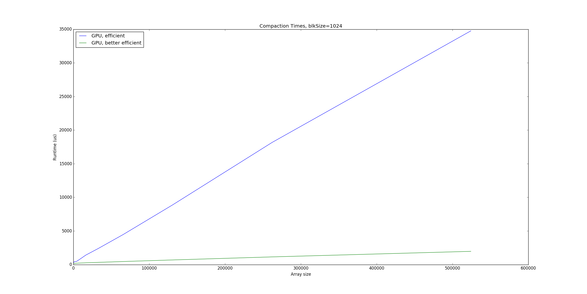

CUDA Stream Compaction
======================

**University of Pennsylvania, CIS 565: GPU Programming and Architecture, Project 2**

* Daniel Krupka
* Tested on: Debian testing (stretch), Intel(R) Core(TM) i7-4710HQ CPU @ 2.50GHz 8GB, GTX 850M


# Project 2 - Stream Compaction
This project's goal was to compare various methods for achieving [stream compaction](http://http.developer.nvidia.com/GPUGems3/gpugems3_ch39.html).
The test program was modified to take block size and array size as arguments, and ran tests for each algorithm on both
power-of-two and non-power-of-two data. Test output was the following:
```
****************
** SCAN TESTS **
****************
    [  33  36  27  15  43  35  36  42  49  21  12  27  40 ...   6   0 ]
==== cpu scan, power-of-two ====
    [   0  33  69  96 111 154 189 225 267 316 337 349 376 ... 12852633 12852639 ]
==== cpu scan, non-power-of-two ====
    [   0  33  69  96 111 154 189 225 267 316 337 349 376 ... 12852608 12852617 ]
    passed
==== naive scan, power-of-two ====
    passed
==== naive scan, non-power-of-two ====
    passed
==== work-efficient scan, power-of-two ====
    passed
==== work-efficient scan, non-power-of-two ====
    passed
==== real work-efficient scan, power-of-two ====
    passed
==== real work-efficient scan, non-power-of-two ====
    passed
==== thrust scan, power-of-two ====
    passed
==== thrust scan, non-power-of-two ====
    passed

*****************************
** STREAM COMPACTION TESTS **
*****************************
    [   3   2   1   3   1   3   2   0   1   1   2   3   2 ...   0   0 ]
==== cpu compact without scan, power-of-two ====
    [   3   2   1   3   1   3   2   1   1   2   3   2   3 ...   1   3 ]
    passed
==== cpu compact without scan, non-power-of-two ====
    [   3   2   1   3   1   3   2   1   1   2   3   2   3 ...   3   1 ]
    passed
==== cpu compact with scan ====
    passed
==== work-efficient compact, power-of-two ====
    passed
==== work-efficient compact, non-power-of-two ====
    passed
==== real work-efficient compact, power-of-two ====
    passed
==== real work-efficient compact, non-power-of-two ====
    passed
```

# Analysis - Scanning
A major step of compaction is scanning. I tested a CPU implementation, a naive CUDA
implementation, two efficient CUDA implementations, and the Thrust library's implementation.


Interestingly, the Thrust implementation fared the worst, though Nvidia's NSight profiler
showed that Thrust was not actually using much GPU time. A likely explanation is that Thrust
may be shuffling data or partitioning the work between CPU and GPU.


Looking at the other implementations on their own shows that the GPU implementations are substantially
faster than the CPU for large workloads, but somewhat slower on small ones. This makes sense, as for small loads,
the GPU is nowhere near fully saturated.

# Analysis - Compaction
Moving on to compaction, the CPU fares even worse.


Focusing on only the GPU implementations, we see that the more optimized version
begins to perform noticeably better, where the two were mostly indistinguishable
for simple scanning.


For the non-optimized GPU reduction, block size had a substantial effect, with
a 1024 thread block performing 1.3x faster than with 128 threads.


The optimized GPU reduction showed much less variance with block size. This likely due to
the active threads no longer being scattered between different warps, allowing for more early
termination and lowering the number of active warps and thus blocks.

